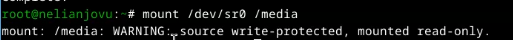
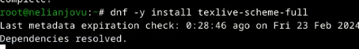
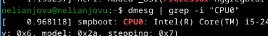

---
## Front matter
title: "Отчёт по лабораторной работы No 1"
subtitle: "Операционные системы"
author: "Нелиа Нджову"

## Generic otions
lang: ru-RU
toc-title: "Содержание"

## Bibliography
bibliography: bib/cite.bib
csl: pandoc/csl/gost-r-7-0-5-2008-numeric.csl

## Pdf output format
toc: true # Table of contents
toc-depth: 2
lof: true # List of figures
lot: true # List of tables
fontsize: 12pt
linestretch: 1.5
papersize: a4
documentclass: scrreprt
## I18n polyglossia
polyglossia-lang:
  name: russian
  options:
	- spelling=modern
	- babelshorthands=true
polyglossia-otherlangs:
  name: english
## I18n babel
babel-lang: russian
babel-otherlangs: english
## Fonts
mainfont: PT Serif
romanfont: PT Serif
sansfont: PT Sans
monofont: PT Mono
mainfontoptions: Ligatures=TeX
romanfontoptions: Ligatures=TeX
sansfontoptions: Ligatures=TeX,Scale=MatchLowercase
monofontoptions: Scale=MatchLowercase,Scale=0.9
## Biblatex
biblatex: true
biblio-style: "gost-numeric"
biblatexoptions:
  - parentracker=true
  - backend=biber
  - hyperref=auto
  - language=auto
  - autolang=other*
  - citestyle=gost-numeric
## Pandoc-crossref LaTeX customization
figureTitle: "Рис."
tableTitle: "Таблица"
listingTitle: "Листинг"
lofTitle: "Список иллюстраций"
lotTitle: "Список таблиц"
lolTitle: "Листинги"
## Misc options
indent: true
header-includes:
  - \usepackage{indentfirst}
  - \usepackage{float} # keep figures where there are in the text
  - \floatplacement{figure}{H} # keep figures where there are in the text
---

# Цель работы

Целью данной работы является приобретение практических навыков установки операционной системы на виртуальную машину, настройки минимально необходимых для дальнейшей работы сервисов.

# Задание

1. Создание виртуальной машины

2. Установка операционной системы

3. Работа после установки

4. Установка программного обеспечения для создания документации

5. Допольнительные задания

# Выполнение лабораторной работы

**1. Создание виртуальной машины**

Я установила и настроила VirtualBox во время выполнения лабораторной работы в прошлом семестре в этом предмете раздел 'Архитектура компьютера', поэтому я сразу открываю VirtualBox(рис.1).

{#fig:001 width=70%}

Нажав 'создать', я создаю новую витуалную машину,указывая ее имя, путь к папке машины по умольчанию меня устраивает, выбираю тип и версию ОС(рис.2)

{#fig:001 width=70%}

Я указываю обьем основной памяти витуальной машины размером 4096МБ(рис.3)

{#fig:001 width=70%}

Я выбираю создание нового витуального жесткого диска(рис.4)

{#fig:001 width=70%}

Я установила конфигурацию жесткого диска: загрузочный VDI(рис.5)

{#fig:001 width=70%}

Я устанавливаю размер диска равным 120 ГБ, расположение жесткого диска оставляю как есть, потому что меня устраивает(рис.6)

{#fig:001 width=70%}

Я выбираю динамический виртуальный жесткий диск при указании формата хранения(рис.7)

{#fig:001 width=70%}

Я выбираю конфигурацию своей витуальной машины в VirtualBox. Я захожу в раздел 'Носители',добавляю новый оптический дискодов и выбираю загруженныйй образ операционной системы Fedora(рис.8)

{#fig:001 width=70%} 

**2. Установка операционной системы**

Я запускаю созданую витуальную машину для установки(рис.9)

{#fig:001 width=70%} 

Я вижу интерфейс начальной конфигурации. Я нажимаю Enter, чтобы создать конфигурацию по умольчанию, затем нажимаю Enter,чтобы выбрат клавишу Win в качестве модификатора(рис.10)

{#fig:001 width=70%}

Я нажмаю Win+Enter для запуска терминала. В терминала запускаю liveinst(рис.11)

{#fig:001 width=70%}

Чтобы переключиться на расположение окон с вкладками, я нажимаю Win+w. Я выбираю язык для использования в процессе установки- английский, потому что мне так удобнее(рис.12)

{#fig:001 width=70%}

Я проверяю место установки и сохраняю значение по умольчанию(рис.13)

{#fig:001 width=70%}

Я установлю аккаунт администратора и создаю пароль для супер-пользователя(рис.14)

{#fig:001 width=70%}

Я создаю пользователя, добавляю адмнистративные привилегии для этой учетной записи, чтобы я мог свободно выполнять команды как супер-пользователя(рис.15)

{#fig:001 width=70%}

Далее устанавливается операционная система. После установки я нажимаю "завершить установку"(рис.16)

{#fig:001 width=70%}

Диск не выключился автоматически, поэтому я захожу в настройки, чтобы отключить его(рис.17)

{#fig:001 width=70%}

Теперь он отключен(рис.18)

{#fig:001 width=70%}

**3. Работа после установки**

Я запускаю виртуальную машину. Я вхожу в ОС под учетной записью, которую я установила во время установки(рис.19)

{#fig:001 width=70%}

Я запускаю Win+Enter, чтобы запустить терминал и переключиться на роль супер-пользователя(рис.20)

{#fig:001 width=70%}

Я обновляю все пакеты(рис.21)

{#fig:001 width=70%}

Я устанавливаю программы для удобства работы в консоли;tmux для открытия нескольких "вкладках" в одном терминале,mc так файловый менеджер в терминале(рис.22)

{#fig:001 width=70%}

Я устанавливаю программы для автоматического обновления(рис.23)

{#fig:001 width=70%}

Я запускаю таймер(рис.24)

{#fig:001 width=70%}

Я перехожу в каталог /etc/selnux, открываю md и ищу нужный мне файл(рис.25)

{#fig:001 width=70%}

Я изменяю открытый файл; SELINUX = enforcing меняю на значение SELINUX = permissive(рис.26)

{#fig:001 width=70%}

Перезагружаю витуальную машину(рис.27)

{#fig:001 width=70%}

Я снова вхожу в ОС, снова запускаю терминал и запускаю терминальный мультиплексор(рис.28)

{#fig:001 width=70%}

Я переключаюсь на роль супер-пользователя(рис.29)

{#fig:001 width=70%}

Я устанавливаю пакет dkms(рис.30)

{#fig:001 width=70%}

В меню витуальную машины я подключаю образ диска гостевой ОС и монтирую диск с помощью утилиты mount(рис.31)

{#fig:001 width=70%}

Я устанавливаю драйверов(рис.32)

{#fig:001 width=70%}

Перезагружаю витуальную машину(рис.33)

{#fig:001 width=70%}

Я снова вхожу в ОС, снова запускаю терминал и запускаю терминальный мультиплексор(рис.34)

{#fig:001 width=70%}

Я захожу в каталог /etc/X11/xorg.conf.d/00-keyboard.conf(рис.35)

{#fig:001 width=70%}

Я редактирую конфигурационный файл(рис.36)

{#fig:001 width=70%}

Перезагружаю витуальную машину(рис.37)

{#fig:001 width=70%}

**4. Установка программного обеспечения для создания документации**

Я запускаю терминал, запускаю терминальный мультиплексор tmux, переключаюсь на роль супер-пользователя. Потом я устанавливаю pandoc, испоьзуя команду dnf и флаг - y, который автоматически отвечает на все системные вопросы "да"(рис.38)

{#fig:001 width=70%}

Я устанавливаю дистрибутив texlive(рис.39)

{#fig:001 width=70%}

**5. Допольнительные задания**

*Домашнее задание*

Я вхожу команду dmesg | less в терминале, чтобы проанализировать последовательность загрузки системы(рис.40)

{#fig:001 width=70%}

Используя поиск, выполняемый командой "dmesg | grep -i", я ищу:

версия ядра Linux;6.7.4-200.fc39.x86_64(рис.41)

{#fig:001 width=70%}

Частота процессора (Detected Mhz processor);2494.336 MHz(рис.42).

{#fig:001 width=70%}

Модель процессора (CPU0)(рис.43).

{#fig:001 width=70%}

Объём доступной оперативной памяти (Memory available)(рис.44).

{#fig:001 width=70%}

Тип обнаруженного гипервизора (Hypervisor detected)(рис.45)

{#fig:001 width=70%}

Тип файловой системы корневого раздела можно проверить с помощью опции fdisk(рис.46)

{#fig:001 width=70%}

Последовательности монтирования файловых систем можно просмотреть, введя слово mount в поле поиска результата dmesg(рис.47)

{#fig:001 width=70%}

*Ответы на контрольные вопросы*

1. Учетная запись содержит необходимые для идентификации пользователя при подключении к системе данные, а так же информацию для авторизации и учета: системного имени (user name) (оно может содержать только латинские буквы и знак нижнее подчеркивание, еще оно должно быть уникальным), идентификатор пользователя (UID) (уникальный идентификатор пользователя в системе, целое положительное число), идентификатор группы (CID) (группа, к к-рой относится пользователь. Она, как минимум, одна, по умолчанию - одна), полное имя (full name) (Могут быть ФИО), домашний каталог (home directory) (каталог, в к-рый попадает пользователь после входа в систему и в к-ром хранятся его данные), начальная оболочка (login shell) (командная оболочка, к-рая запускается при входе в систему).

2. Для получения справки по команде: –help; для перемещения по файловой системе - cd; для просмотра содержимого каталога - ls; для определения объёма каталога - du ; для создания / удаления каталогов - mkdir/rmdir; для создания / удаления файлов - touch/rm; для задания определённых прав на файл / каталог - chmod; для просмотра истории команд - history

3. Файловая система - это порядок, определяющий способ организации и хранения и именования данных на различных носителях информации. Примеры: FAT32 представляет собой пространство, разделенное на три части: олна область для служебных структур, форма указателей в виде таблиц и зона для хранения самих файлов. ext3/ext4 - журналируемая файловая система, используемая в основном в ОС с ядром Linux.

4. С помощью команды df, введя ее в терминале. Это утилита, которая показывает список всех файловых систем по именам устройств, сообщает их размер и данные о памяти. Также посмотреть подмонтированные файловые системы можно с помощью утилиты mount.

5. Чтобы удалить зависший процесс, вначале мы должны узнать, какой у него id: используем команду ps. Далее в терминале вводим команду kill < id процесса >. Или можно использовать утилиту killall, что “убьет” все процессы, которые есть в данный момент, для этого не нужно знать id процесса.

# Выводы

Выполняя эту лабораторную работу, я приобрел практические навыки установки операционной системы на витуальную машину, а также произвел настройка минимальных сервисов, необходимых для дальнейшей работы

# Список литературы{.unnumbered}

::: {
1. Dash, P. Getting Started with Oracle VM VirtualBox / P. Dash. – Packt Publishing Ltd, 2013. – 86 сс.
2. Colvin, H. VirtualBox: An Ultimate Guide Book on Virtualization with VirtualBox. VirtualBox / H. Colvin. – CreateSpace Independent Publishing Platform, 2015. – 70 сс.
3. Vugt, S. van. Red Hat RHCSA/RHCE 7 cert guide : Red Hat Enterprise Linux 7 (EX200 and EX300) : Certification Guide. Red Hat RHCSA/RHCE 7 cert guide / S. van Vugt. – Pearson IT Certification, 2016. – 1008 сс.
4. Робачевский, А. Операционная система UNIX / А. Робачевский, С. Немнюгин, О. Стесик. – 2-е изд. – Санкт-Петербург : БХВ-Петербург, 2010. – 656 сс.
5. Немет, Э. Unix и Linux: руководство системного администратора. Unix и Linux / Э. Немет, Г. Снайдер, Т.Р. Хейн, Б. Уэйли. – 4-е изд. – Вильямс, 2014. – 1312 сс.
6. Колисниченко, Д.Н. Самоучитель системного администратора Linux : Системный администратор / Д.Н. Колисниченко. – Санкт-Петербург : БХВ-Петербург, 2011. – 544 сс.
7. Robbins, A. Bash Pocket Reference / A. Robbins. – O’Reilly Media, 2016. – 156 сс.
}
:::
