---
## Front matter
lang: ru-RU
title: Лабораторная работа No2
subtitle: Операционные системы
author:
  - Нджову Н.
institute:
  - Российский университет дружбы народов, Москва, Россия
date: 28 февраля

## i18n babel
babel-lang: russian
babel-otherlangs: english

## Formatting pdf
toc: false
toc-title: Содержание
slide_level: 2
aspectratio: 169
section-titles: true
theme: metropolis
header-includes:
 - \metroset{progressbar=frametitle,sectionpage=progressbar,numbering=fraction}
 - '\makeatletter'
 - '\beamer@ignorenonframefalse'
 - '\makeatother'
---

## Цель работы

Цель работы является изучение идеологии и применения средств контроля версий, освоение умения по работе с git

## Задание

1. Создать базовую конфигурацию для работы с git.

2. Базовая настройка git

3. Создать ключ SSH.

4. Создать ключ PGP.

5. Зарегистрироваться на Github.

6. Добавление PGP ключа в GitHub

7. Настроить подписи git.

8. Настройка gh

9. Сознание репозитория курса на основе шаблона

## 1. Создать базовую конфигурацию для работы с git.

Я устанавливаю git через терминал с помощью dnf install git

Я устанавливаю gh через терминал с помощью dnf install gh(рис.1)

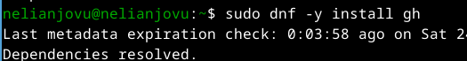{#fig:001 width=70%}

## 2. Базовая настройка git

Я задаю имя и email владельца репозитория и настраиваю ut-8 в выводе сообщений git для корректного отображения(рис.2)

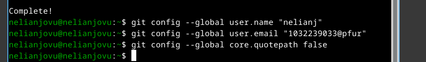{#fig:002 width=70%}

## 2. Базовая настройка git

Я задаю имя master начальной ветке(рис.3)

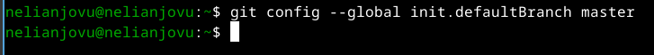{#fig:003 width=70%}

Я задаю параметры autocrlf и safecrlf для корректного отображения конца строки

## 3. Создать ключ SSH.

Я создаю ключ ssh размером 4096 ,бит по алгоритму rsa(рис.4)

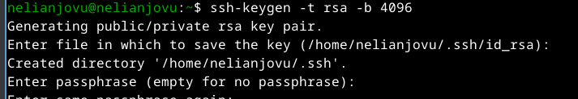{#fig:004 width=70%}

## 3. Создать ключ SSH.

Я создаю ключ ssh по алгоритму ed25519

Я генерирую ключ GPG, затем выбираю RSA и тип ключа RSA, устанавливаю максимальную длину ключа-4096 и оставляю ключ на неограниченный срок действия. Далее я отвечаю на вопросы программы о личной информации(рис.5)

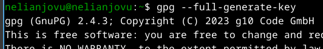{#fig:005 width=70%}

## 4. Создать ключ PGP.

Я ввожу фразу-пароль для защиты нового ключа(рис.6)

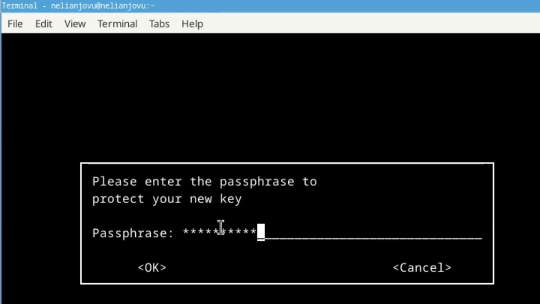{#fig:006 width=70%}

## 5. Зарегистрироваться на Github.

У меня уже была создана учетная запись на github,и я также заполнила и настроила ее, поэтому я просто вхожу в свою учетную запись(рис.7)

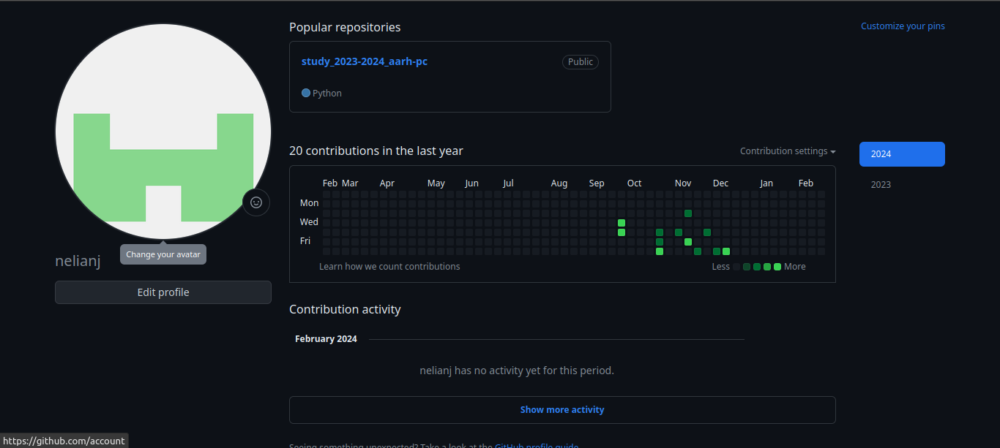{#fig:007 width=70%}

## 6. Добавление PGP ключа в GitHub

Я вывожу список созданных ключей на терминал, ищу отпечаток ключа в результате запроса(последовательность байтов, используемая для идентификации более длинного, по сравнению с самим отпечатком ключа), он стоит после знака косой черты, копирую его в буфер обмен(рис.8)

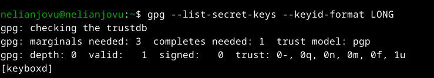{#fig:008 width=70%}

## 6. Добавление PGP ключа в GitHub

Я копирую сам ключ gpg в буфер обмена

Я открываю настройка github, ищу среди них добавление gpg ключа

## 6. Добавление PGP ключа в GitHub

Я нажимаю на "New GPG key" и вставляю в поле ключ из буфера обмена

Я добавила ключ gpg на github(рис.9)

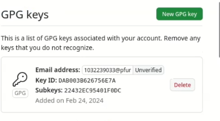{#fig:009 width=70%}

## 7. Настроить подписи git.

Я настраиваю автоматические подпись коммитов git; используя адрес электронной почты, который я ввел ранее, я говорю git использовать его прт создании подписей коммитов(рис.10)

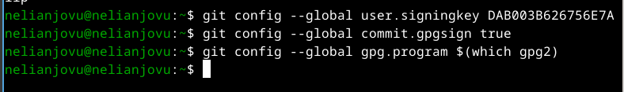{#fig:010 width=70%}

## 8. Настройка gh

Я начинаю авторизацию в gh, отвечаю на наводящие вопросы утилиты и в конце выбираю войти через браузер(рис.11)

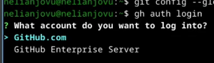{#fig:011 width=70%}

## 8. Настройка gh

Я завершаю авторизацию на сайте

Я вижу сщщбшение о завершении авторизации под именем nelianj

## 9. Сознание репозитория курса на основе шаблона

Я создаю директорию с помощью команду mkdir и флага -p. Потом я перехожу в только созданную директорию "Операционные системы" с помощью команду cd. После этого я ввожу команду 'gh repo create study_2023-2024_os-intro --template=yamadharma/course-directory-student-template --public', чтобы создать репозиторий на основе шаблона репозитория

Я копирую репозиторий к себе в директорию, я указываю ссылку с проколотом https, а не ssh, потому что при авторизации в gh выбрала протокол https(рис.12)

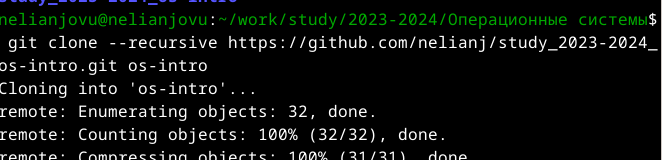{#fig:012 width=70%}

## 8. Настройка gh

Я захожу в каталог курсов с помощью команды cd и удаляю файл package.json с помощью команды rm

Я создаю необходимо каталог используя makefile(рис.13)

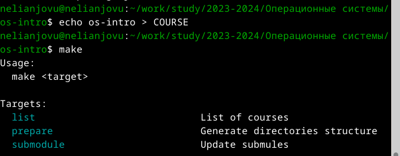{#fig:013 width=70%}

## 8. Настройка gh

Я добавляю все новые файлы для отправки на сервер

Я отправляю файлы на сервер(рис.14)

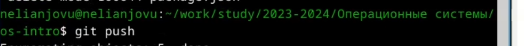{#fig:014 width=70%}

## Выводы

Выполняя эту лабораторную работу, я изучил идеологю и применение инструментов контроля версий, а также освоил умение работать с git.

