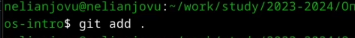

---
## Front matter
title: "Отчет по лабораторной работе No2"
subtitle: "Операционные системы"
author: "Нелиа Нджову"

## Generic otions
lang: ru-RU
toc-title: "Содержание"

## Bibliography
bibliography: bib/cite.bib
csl: pandoc/csl/gost-r-7-0-5-2008-numeric.csl

## Pdf output format
toc: true # Table of contents
toc-depth: 2
lof: true # List of figures
lot: true # List of tables
fontsize: 12pt
linestretch: 1.5
papersize: a4
documentclass: scrreprt
## I18n polyglossia
polyglossia-lang:
  name: russian
  options:
	- spelling=modern
	- babelshorthands=true
polyglossia-otherlangs:
  name: english
## I18n babel
babel-lang: russian
babel-otherlangs: english
## Fonts
mainfont: PT Serif
romanfont: PT Serif
sansfont: PT Sans
monofont: PT Mono
mainfontoptions: Ligatures=TeX
romanfontoptions: Ligatures=TeX
sansfontoptions: Ligatures=TeX,Scale=MatchLowercase
monofontoptions: Scale=MatchLowercase,Scale=0.9
## Biblatex
biblatex: true
biblio-style: "gost-numeric"
biblatexoptions:
  - parentracker=true
  - backend=biber
  - hyperref=auto
  - language=auto
  - autolang=other*
  - citestyle=gost-numeric
## Pandoc-crossref LaTeX customization
figureTitle: "Рис."
tableTitle: "Таблица"
listingTitle: "Листинг"
lofTitle: "Список иллюстраций"
lotTitle: "Список таблиц"
lolTitle: "Листинги"
## Misc options
indent: true
header-includes:
  - \usepackage{indentfirst}
  - \usepackage{float} # keep figures where there are in the text
  - \floatplacement{figure}{H} # keep figures where there are in the text
---

# Цель работы

Цель работы является изучение идеологии и применения средств контроля версий, освоение умения по работе с git

# Задание

1. Создать базовую конфигурацию для работы с git.

2. Базовая настройка git

3. Создать ключ SSH.

4. Создать ключ PGP.

5. Зарегистрироваться на Github.

6. Добавление PGP ключа в GitHub

7. Настроить подписи git.

8. Настройка gh

9. Сознание репозитория курса на основе шаблона

# Выполнение лабораторной работы

**1. Создать базовую конфигурацию для работы с git.**

Я устанавливаю git через терминал с помощью dnf install git(рис.1) 

{#fig:001 width=70%}

Я устанавливаю gh через терминал с помощью dnf install gh(рис.2)

{#fig:001 width=70%}

**2. Базовая настройка git**

Я задаю имя и email владельца репозитория (свои имя, фамилию и электронную почту) и настраиваю ut-8 в выводе сообщений git для корректного отображения(рис.3)

{#fig:001 width=70%}

Я задаю имя master начальной ветке(рис.4)

{#fig:001 width=70%}

Я задаю параметры autocrlf и safecrlf для корректного отображения конца строки

{#fig:001 width=70%}

{#fig:001 width=70%}

**3. Создать ключ SSH.**

Я создаю ключ ssh размером 4096 ,бит по алгоритму rsa(рис.7)

{#fig:001 width=70%}

Я создаю ключ ssh по алгоритму ed25519(рис.8)

{#fig:001 width=70%}

**4. Создать ключ PGP.**

Я генерирую ключ GPG, затем выбираю RSA и тип ключа RSA, устанавливаю максимальную длину ключа-4096 и оставляю ключ на неограниченный срок действия. Далее я отвечаю на вопросы программы о личной информации(рис.9)

{#fig:001 width=70%}

Я ввожу фразу-пароль для защиты нового ключа(рис.10)

{#fig:001 width=70%}

**5. Зарегистрироваться на Github.**

У меня уже была создана учетная запись на github,и я также заполнила и настроила ее, поэтому я просто вхожу в свою учетную запись(рис.11)

{#fig:001 width=70%}

**6. Добавление PGP ключа в GitHub**

Я вывожу список созданных ключей на терминал, ищу отпечаток ключа в результате запроса(последовательность байтов, используемая для идентификации более длинного, по сравнению с самим отпечатком ключа), он стоит после знака косой черты, копирую его в буфер обмен(рис.12)

{#fig:001 width=70%}

Я копирую сам ключ gpg в буфер обмена(рис.13)

{#fig:001 width=70%}

Я открываю настройка github, ищу среди них добавление gpg ключа(рис.14)

{#fig:001 width=70%}

Я нажимаю на "New GPG key" и вставляю в поле ключ из буфера обмена(рис.15)

{#fig:001 width=70%}

Я добавила ключ gpg на github(рис.16)

{#fig:001 width=70%}

**7. Настроить подписи git.**

Я настраиваю автоматические подпись коммитов git; используя адрес электронной почты, который я ввел ранее, я говорю git использовать его прт создании подписей коммитов(рис.17)

{#fig:001 width=70%}

**8. Настройка gh**

Я начинаю авторизацию в gh, отвечаю на наводящие вопросы утилиты и в конце выбираю войти через браузер(рис.18)

{#fig:001 width=70%}

Я завершаю авторизацию на сайте(рис.19)

{#fig:001 width=70%}

Я вижу сщщбшение о завершении авторизации под именем nelianj(рис.20)

{#fig:001 width=70%}

**9. Сознание репозитория курса на основе шаблона**

Я создаю директорию с помощью команду mkdir и флага -p, который позволяет установить каталоги на всем указанном пути. Потом я перехожу в только созданную директорию "Операционные системы" с помощью команду cd. После этого я ввожу команду 'gh repo create study_2023-2024_os-intro --template=yamadharma/course-directory-student-template --public', чтобы создать репозиторий на основе шаблона репозитория(рис.21)

{#fig:001 width=70%}

Я копирую репозиторий к себе в директорию, я указываю ссылку с проколотом https, а не ssh, потому что при авторизации в gh выбрала протокол https(рис.22)

{#fig:001 width=70%}

Я захожу в каталог курсов с помощью команды cd и удаляю файл package.json с помощью команды rm(рис.23)

{#fig:001 width=70%}

Я создаю необходимо каталог используя makefile(рис.24)

{#fig:001 width=70%}

Я добавляю все новые файлы для отправки на сервер(сохраняю добавление изменения) с помощью команды git add и комментирую их с помощью git commit

{#fig:001 width=70%}

{#fig:001 width=70%}

Я отправляю файлы на сервер с помощью git push(рис.27)

{#fig:001 width=70%}

*Ответы на контрольные вопросы*

1. Системы контроля версий (VCS) - программное обеспечение для облегчения работы с изменяющейся информацией. Они позволяют хранить несколько версий изменяющейся информации, одного и того же документа, может предоставить доступ к более ранним версиям документа. Используется для работы нескольких человек над проектом, позволяет посмотреть, кто и когда внес какое-либо изменение и т. д. VCS ррименяются для: Хранения понлой истории изменений, сохранения причин всех изменений, поиска причин изменений и совершивших изменение, совместной работы над проектами

2. Хранилище – репозиторий, хранилище версий, в нем хранятся все документы, включая историю их изменения и прочей служебной информацией.commit – отслеживание изменений, сохраняет разницу в изменениях. История – хранит все изменения в проекте и позволяет при необходимости вернуться/обратиться к нужным данным. Рабочая копия – копия проекта, основанная на версии из хранилища, чаще всего последней версии

3. Централизованные VCS (например: CVS, TFS, AccuRev) – одно основное хранилище всего проекта. Каждый пользователь копирует себе необходимые ему файлы из этого репозитория, изменяет, затем добавляет изменения обратно в хранилище. Децентрализованные VCS (например: Git, Bazaar) – у каждого пользователя свой вариант репозитория (возможно несколько вариантов), есть возможность добавлять и забирать изменения из любого репозитория. В отличие от классических, в распределенных (децентралиованных) системах контроля версий центральный репозиторий не является обязательным.

4. Сначала создается и подключается удаленный репозиторий, затем по мере изменения проекта эти изменения отправляются на сервер.

5. Участник проекта перед началом работы получает нужную ему версию проекта в хранилище, с помощью определенных команд, после внесения изменений пользователь размещает новую версию в хранилище. При этом предыдущие версии не удаляются. К ним можно вернуться в любой момент.

6. Хранение информации о всех изменениях в вашем коде, обеспечение удобства командной работы над кодом.

7. Создание основного дерева репозитория: git init Получение обновлений (изменений) текущего дерева из центрального репозитория: git pull.Отправка всех произведённых изменений локального дерева в центральный репозиторий: git push.Просмотр списка изменённых файлов в текущей директории: git status.Просмотр текущих изменений: git diff.
Сохранение текущих изменений: добавить все изменённые и/или созданные файлы и/или каталоги: git add . добавить конкретные изменённые и/или созданные файлы и/или каталоги: git add имена_файлов. удалить файл и/или каталог из индекса репозитория (при этом файл и/или каталог остаётся в локальной директории): git rm имена_файлов.
Сохранение добавленных изменений: сохранить все добавленные изменения и все изменённые файлы: git commit -am ‘Описание коммита’ сохранить добавленные изменения с внесением комментария через встроенный редактор: git commit. создание новой ветки, базирующейся на текущей: git checkout -b имя_ветки переключение на некоторую ветку: git checkout имя_ветки (при переключении на ветку, которой ещё нет в локальном репозитории, она будет создана и связана с удалённой). отправка изменений конкретной ветки в центральный репозиторий: git push origin имя_ветки. слияние ветки с текущим деревом: git merge –no-ff имя_ветки. Удаление ветки: удаление локальной уже слитой с основным деревом ветки: git branch -d имя_ветки. принудительное удаление локальной ветки: git branch -D имя_ветки. удаление ветки с центрального репозитория: git push origin :имя_ветки.

8. git push -all отправляем из локального репозитория все сохраненные изменения в центральный репозиторий, предварительно создав локальный репозиторий и сделав предварительную конфигурацию.

9. Ветвление - один из параллельных участков в одном хранилище, исходящих из одной версии, обычно есть главная ветка. Между ветками, т. е. их концами возможно их слияние. Используются для разработки новых функций

10. Во время работы над проектом могут создаваться файлы, которые не следуют добавлять в репозиторий. Например, временные файлы. Можно прописать шаблоны игнорируемых при добавлении в репозиторий типов файлов в файл .gitignore с помощью сервисов.

# Выводы

Выполняя эту лабораторную работу, я изучил идеологю и применение инструментов контроля версий, а также освоил умение работать с git.

# Список литературы{.unnumbered}

1.Лабораторная работа № 2
