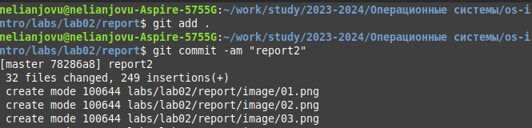

---
## Front matter
lang: ru-RU
title: Лабораторная работа No3
subtitle: Операционные системы
author:
  - Нджову Н. НКАбд-04-23
institute:
  - Российский университет дружбы народов, Москва, Россия
date: 29 февраля 2024

## i18n babel
babel-lang: russian
babel-otherlangs: english

## Formatting pdf
toc: false
toc-title: Содержание
slide_level: 2
aspectratio: 169
section-titles: true
theme: metropolis
header-includes:
 - \metroset{progressbar=frametitle,sectionpage=progressbar,numbering=fraction}
 - '\makeatletter'
 - '\beamer@ignorenonframefalse'
 - '\makeatother'
---

## Цель работы

Цель работы - Научиться оформлять отчёты с помощью легковесного языка разметки Markdown

## Задание

1. Сделайте отчёт по предыдущей лабораторной работе в формате Markdown.

2. В качестве отчёта просьба предоставить отчёты в 3 форматах: pdf, docx и md (в архиве,
поскольку он должен содержать скриншоты, Makefile и т.д

## Выполнение лабораторной работы

Я зашла в директорию где находиться report.md

Я скопировала файл report.md, в котором я буду работать(рис.1)

{#fig:001 width=70%}

## Выполнение лабораторной работы

Потом я открыла файл с помощью текстового редактора(рис.2)

{#fig:002 width=70%}

## Выполнение лабораторной работы

После изменения содержимого в соответствии с языком разметки Markdown, я скомпилировала его из формата md в форматы pdf и docx(рис.3)

{#fig:003 width=70%}

## Выполнение лабораторной работы

Потом я отправила созданные файлы в репозитории на github(рис.5 и 6)

{#fig:005 width=70%}

{#fig:006 width=70%}

## Выводы

При выполнении данной лабораторной работы я научилась оформлять отчёты с помощью легковесного языка разметки Markdown

