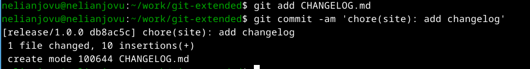

---
## Front matter
lang: ru-RU
title: Лабораторная работа No4
subtitle: Операционные системы
author:
  - Нджову Н.
institute:
  - Российский университет дружбы народов, Москва, Россия
date: 08 марта 2024

## i18n babel
babel-lang: russian
babel-otherlangs: english

## Formatting pdf
toc: false
toc-title: Содержание
slide_level: 2
aspectratio: 169
section-titles: true
theme: metropolis
header-includes:
 - \metroset{progressbar=frametitle,sectionpage=progressbar,numbering=fraction}
 - '\makeatletter'
 - '\beamer@ignorenonframefalse'
 - '\makeatother'
---

## Цель работы

Цель работы является получение навыков правильной работы с репозиториями git.

## Задание

1. Выполнить работу для тестового репозитория.

2. Преобразовать рабочий репозиторий в репозиторий с git-flow и conventional commits.

## 1. Установка git-flow

Сначала я включаю репозиторий copr(рис.1),после этого устанавливаю gitflow(рис.2)

{#fig:001 width=70%}

{#fig:002 width=70%}

## 2. Установка Node.js

Я устанавливаю nodejs.На Node.js базируется программное обеспечение для семантического версионирования и общепринятых коммитов(рис.3)

{#fig:003 width=70%}

## 2. Установка Node.js

Потом я устанавливаю pnpm(рис.4)

{#fig:004 width=70%}

## 3. Настройка Node.js

Для работы с Node.js добавим каталог с исполняемыми файлами, устанавливаемыми yarn, в переменную PATH.Я запускаю команду pnpm setup. Эта команда автоматически устанавливает yarn в переменную path(рис 5)

{#fig:005 width=70%}

Затем я выпольняю команду source ~/.bashrc

## 4. Общепринятые коммиты

Я запускаю команду, которая используется для помощи в форматировании коммитов.При этом устанавливается скрипт git-cz, который мы и будем использовать для коммитов(рис.6)

{#fig:006 width=70%} 

## 4. Общепринятые коммиты

Я запускаю команду, которая испоьзуется для помощи в создании логов(рис.7)

{#fig:007 width=70%} 

## 4. Общепринятые коммиты

Я создаю новый репозиторий под названием git-extended

Я клонирую его в рабочную папку

Потом я делаю первый коммитов и выкладываю его на github(рис.8)

{#fig:008 width=70%} 

## 4. Общепринятые коммиты

Я создаю файл package.json с помощью команды pnpm init.Этот файл важен, поскольку он содержит метаданные о проекте(рис.9)

{#fig:009 width=70%} 

## 4. Общепринятые коммиты

Я сконфигурирую формат коммитов. Для этого я дабавлю в файл package.json команду для формирования коммитов(рис.10)

{#fig:010 width=70%}

## 4. Общепринятые коммиты  

Потом добавлю новый файл на github

Я выпоняю коммитов с помощью git cz(рис.11)

{#fig:011 width=60%}

## 4. Общепринятые коммиты

Затем я отправляю на github

Я инициализирую git flow с помощью команду git flow init(рис.12)

{#fig:012 width=70%}

## 4. Общепринятые коммиты

Я проверяю что я на ветке develop(рис.13)

{#fig:013 width=70%}

## 4. Общепринятые коммиты

Я загружаю весь репозиторий в хранилище(рис.14)

{#fig:014 width=70%}

## 4. Общепринятые коммиты

Я устанавливаю внешнюю ветку как вышестоящую для этой ветки(рис.15)

{#fig:015 width=70%}

## 4. Общепринятые коммиты

Я создаю релиз с версиеи 1.0.0(рис.16)

{#fig:016 width=70%}

## 4. Общепринятые коммиты

Потом я создаю журнал изменений(рис.17)

{#fig:017 width=70%}

## 4. Общепринятые коммиты

После этого я дабовлю журнал изменений в индекс(рис.18)

{#fig:018 width=70%}

## 4. Общепринятые коммиты

Я заполняю релизную ветку в основную ветку(рис.19)

{#fig:019 width=70%}

## 4. Общепринятые коммиты

Я отправляю данные на github(рис.20)

{#fig:020 width=70%}

## 4. Общепринятые коммиты

Я создаю релиз на github(рис.21)

{#fig:021 width=70%}

## 4. Общепринятые коммиты

Я создаю ветку для новой функциональности(рис.22)

{#fig:022 width=70%}

По окончании разработки новой функциональности следующим шагом следует объединить ветку feature_branch c develop(рис.23)

{#fig:023 width=70%}

## 4. Общепринятые коммиты

Я создаю релиз с версиеи 1.2.3

Я обновлю номер версии в файле package.json. Установливаю её в 1.2.3(рис.24)

{#fig:024 width=70%}

## 4. Общепринятые коммиты

Я создаю журнал изменений(рис.25)

{#fig:025 width=70%}

Я добавляю журнал изменений в индекс

Заполняю релизную ветку в основную ветку

## 4. Общепринятые коммиты

Я отправяю данные на github

Я создаю релиз на github с комментарием из журнала изменений(рис.26)

{#fig:026 width=70%}

# Выводы

Выполняя эту лабораторную работу, я получаю навыки правильной работы с репозиториями git.

