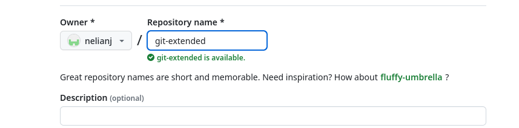

---
## Front matter
title: "Лабораторная работа No4"
subtitle: "Операционные системы"
author: "Нелиа Нджову"

## Generic otions
lang: ru-RU
toc-title: "Содержание"

## Bibliography
bibliography: bib/cite.bib
csl: pandoc/csl/gost-r-7-0-5-2008-numeric.csl

## Pdf output format
toc: true # Table of contents
toc-depth: 2
lof: true # List of figures
lot: true # List of tables
fontsize: 12pt
linestretch: 1.5
papersize: a4
documentclass: scrreprt
## I18n polyglossia
polyglossia-lang:
  name: russian
  options:
	- spelling=modern
	- babelshorthands=true
polyglossia-otherlangs:
  name: english
## I18n babel
babel-lang: russian
babel-otherlangs: english
## Fonts
mainfont: PT Serif
romanfont: PT Serif
sansfont: PT Sans
monofont: PT Mono
mainfontoptions: Ligatures=TeX
romanfontoptions: Ligatures=TeX
sansfontoptions: Ligatures=TeX,Scale=MatchLowercase
monofontoptions: Scale=MatchLowercase,Scale=0.9
## Biblatex
biblatex: true
biblio-style: "gost-numeric"
biblatexoptions:
  - parentracker=true
  - backend=biber
  - hyperref=auto
  - language=auto
  - autolang=other*
  - citestyle=gost-numeric
## Pandoc-crossref LaTeX customization
figureTitle: "Рис."
tableTitle: "Таблица"
listingTitle: "Листинг"
lofTitle: "Список иллюстраций"
lotTitle: "Список таблиц"
lolTitle: "Листинги"
## Misc options
indent: true
header-includes:
  - \usepackage{indentfirst}
  - \usepackage{float} # keep figures where there are in the text
  - \floatplacement{figure}{H} # keep figures where there are in the text
---

# Цель работы

Цель работы является получение навыков правильной работы с репозиториями git.

# Задание

1. Выполнить работу для тестового репозитория.

2. Преобразовать рабочий репозиторий в репозиторий с git-flow и conventional commits.

# Выполнение лабораторной работы

**1. Установка git-flow**

Сначала я включаю репозиторий copr(рис.1),после этого устанавливаю gitflow(рис.2)

{#fig:001 width=70%}

{#fig:001 width=70%}

**2. Установка Node.js**

Я устанавливаю nodejs.На Node.js базируется программное обеспечение для семантического версионирования и общепринятых коммитов(рис.3)

{#fig:001 width=70%}

Потом я устанавливаю pnpm(рис.4)

{#fig:001 width=70%}

**3. Настройка Node.js**

Для работы с Node.js добавим каталог с исполняемыми файлами, устанавливаемыми yarn, в переменную PATH.Я запускаю команду pnpm setup. Эта команда автоматически устанавливает yarn в переменную path(рис 5)

{#fig:001 width=70%}

Затем я выпольняю команду source ~/.bashrc(рис.6)

{#fig:001 width=70%}

**4. Общепринятые коммиты**

*commitizen*

Я запускаю команду, которая используется для помощи в форматировании коммитов.При этом устанавливается скрипт git-cz, который мы и будем использовать для коммитов(рис.7)

{#fig:001 width=70%} 

*standard-changelog*

Я запускаю команду, которая испоьзуется для помощи в создании логов(рис.8)

{#fig:001 width=70%} 

*Практический сценарий использования git*

Я создаю новый репозиторий под названием git-extended(рис.9)

{#fig:001 width=70%} 

Я клонирую его в рабочную папку(рис.10)

{#fig:001 width=70%} 

Потом я делаю первый коммитов и выкладываю его на github(рис.11)

{#fig:001 width=70%} 

Я создаю файл package.json с помощью команды pnpm init.Этот файл важен, поскольку он содержит метаданные о проекте(рис.12)

{#fig:001 width=70%} 

Я сконфигурирую формат коммитов. Для этого я дабавлю в файл package.json команду для формирования коммитов(рис.13)

{#fig:001 width=70%}  

Потом добавлю новый файл на github(рис.14)

{#fig:001 width=70%}

Я выпоняю коммитов с помощью git cz(рис.15)

{#fig:001 width=70%}

Затем я отправляю на github(рис.16)

{#fig:001 width=70%}

Я инициализирую git flow с помощью команду git flow init(рис.17)

{#fig:001 width=70%}

Я проверяю что я на ветке develop(рис.18)

{#fig:001 width=70%}

Я загружаю весь репозиторий в хранилище(рис.19)

{#fig:001 width=70%}

Я устанавливаю внешнюю ветку как вышестоящую для этой ветки(рис.20)

{#fig:001 width=70%}

Я создаю релиз с версиеи 1.0.0(рис.22)

{#fig:001 width=70%}

Потом я создаю журнал изменений(рис.23)

{#fig:001 width=70%}

После этого я дабовлю журнал изменений в индекс(рис.24)

{#fig:001 width=70%}

Я заполняю релизную ветку в основную ветку(рис.25)

{#fig:001 width=70%}

Я отправляю данные на github(рис.26)

{#fig:001 width=70%}

Я создаю релиз на github.Для этого буду использовать утилиты работы с github "gh release create v1.0.0 -F CHANGELOG.md"(рис.27)

{#fig:001 width=70%}

Я создаю ветку для новой функциональности(рис.28)

{#fig:001 width=70%}

По окончании разработки новой функциональности следующим шагом следует объединить ветку feature_branch c develop(рис.28)

{#fig:001 width=70%}

Я создаю релиз с версиеи 1.2.3(рис.29)

{#fig:001 width=70%}

Я обновлю номер версии в файле package.json. Установливаю её в 1.2.3(рис.30)

{#fig:001 width=70%}

Я создаю журнал изменений(рис.31)

{#fig:001 width=70%}

Я добавляю журнал изменений в индекс(рис.32)

{#fig:001 width=70%}

Заполняю релизную ветку в основную ветку(рис.33)

{#fig:001 width=70%}

Я отправяю данные на github(рис.34)

{#fig:001 width=70%}

Я создаю релиз на github с комментарием из журнала изменений(рис.35)

{#fig:001 width=70%}

# Выводы

Выполняя эту лабораторную работу, я получаю навыки правильной работы с репозиториями git.

# Список литературы{.unnumbered}

Лабораторная работа № 4
