---
## Front matter
lang: ru-RU
title: Лабораторная работа No5
subtitle: Операционные системы
author:
  - Нджову Н.
institute:
  - Российский университет дружбы народов, Москва, Россия
date: 15 марта 2024

## i18n babel
babel-lang: russian
babel-otherlangs: english

## Formatting pdf
toc: false
toc-title: Содержание
slide_level: 2
aspectratio: 169
section-titles: true
theme: metropolis
header-includes:
 - \metroset{progressbar=frametitle,sectionpage=progressbar,numbering=fraction}
 - '\makeatletter'
 - '\beamer@ignorenonframefalse'
 - '\makeatother'
---

## Цель работы

Создать и настроить систему управления паролями и конфигурационными файлами

## Задание

1. Установка менеджера паролей pass

2. Настройка

3. Настройка интерфейса с броузером

4. Сохранение пароля

5. Управление файлами конфигурации

6. Установка и настройка chezmoi для управления конфигурационными файлами 

## 1. Установка менеджера паролей pass

Я устанавливаю pass.Менеджер паролей pass — программа, сделанная в рамках идеологии Unix.Также носит название стандартного менеджера паролей для Unix (рис.1)

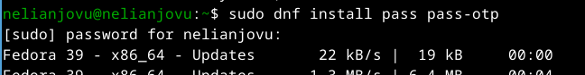{#fig:001 width=70%}

## 1. Установка менеджера паролей pass

Потом устанавливаю gopass(рис.2)

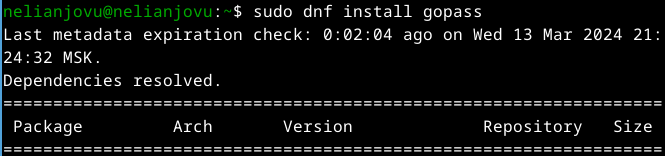{#fig:002 width=70%}

## 2. Настройка

Просиотрю списка ключи gpg.Файлы шифруются с помощью GPG-ключа.(рис.3)

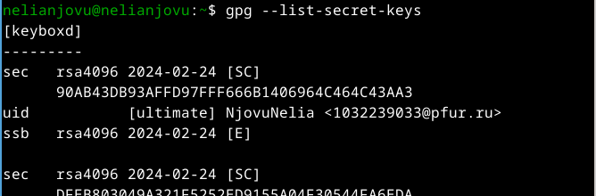{#fig:003 width=70%}

## 2. Настройка

Я инициализацию хранилище(рис.4)

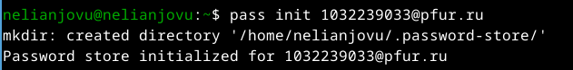{#fig:004 width=70%}

## 2. Настройка

Я создаю структуру git с помощью комманду pass git init(рис.5)

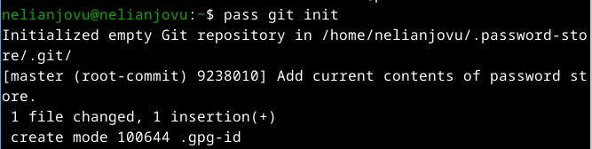{#fig:005 width=70%}

## 3. Настройка интерфейса с броузером

Я устанавливаю плагин

Для взаимодействия с броузером используется интерфейс native messaging.Поэтому кроме плагина к броузеру, устанавливаю программа, обеспечивающая интерфейс native messaging(рис.6 и рис.7)

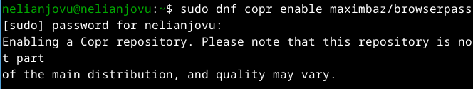{#fig:006 width=70%}

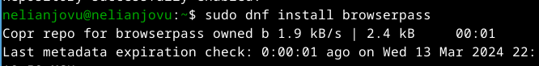{#fig:007 width=70%}

## 4. Сохранение пароля

Я Добавляю новый пароль, выполнив комманду pass insert lab5/lab5.txt(рис.8)

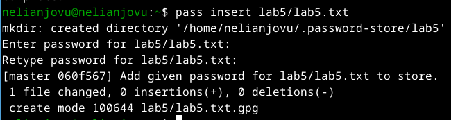{#fig:008 width=70%}

## 4. Сохранение пароля

Я отображаю пароль для указанного имени файла(рис.9)

{#fig:009 width=70%}

## 4. Сохранение пароля

После этого я заменяю существующий пароль(рис.10)

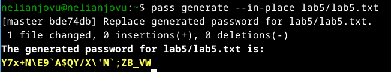{#fig:010 width=70%}

## 5. Управление файлами конфигурации

Я установливаю дополнительное программное обеспечение(рис.11)

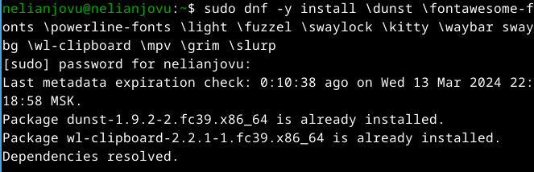{#fig:011 width=70%}

## 5. Управление файлами конфигурации

Я установливаю шрифты(рис.12, рис.13 и рис.14)

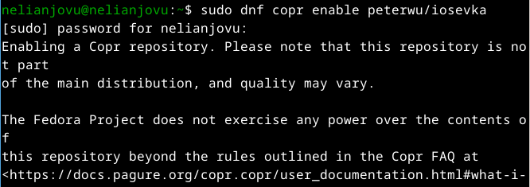{#fig:012 width=70%}

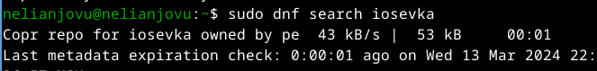{#fig:013 width=70%}

## 5. Управление файлами конфигурации

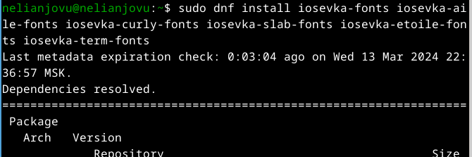{#fig:014 width=70%}

## 6. Установка и настройка chezmoi для управления конфигурационными файлами

Я установливаю бинарный файл chezmoi.chezmoi используется для управления файлами конфигурации домашнего каталога пользователя. Скрипт определяет архитектуру процессора и операционную систему и скачивает необходимый файл(рис.15)

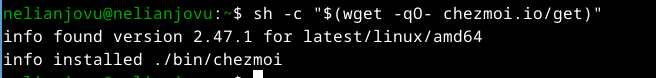{#fig:015 width=70%}

## 6. Установка и настройка chezmoi для управления конфигурационными файлами

Использование утилиты командной строки для работы с github, я создаю свой репозиторий для конфигурационных файлов на основе шаблона(рис.16)

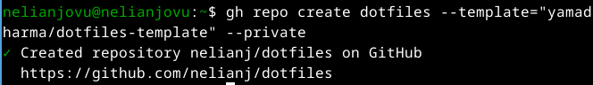{#fig:016 width=70%}

## 6. Установка и настройка chezmoi для управления конфигурационными файлами

Я инициализирую chezmoi с моем репозиторием dotfiles(рис.17)

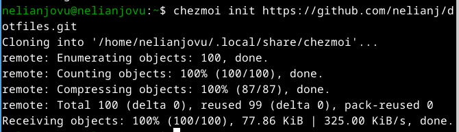{#fig:017 width=70%}

## 6. Установка и настройка chezmoi для управления конфигурационными файлами

Я проверяю, какие изменения внесёт chezmoi в домашний каталог, запустив chezmoi diff(рис.18)

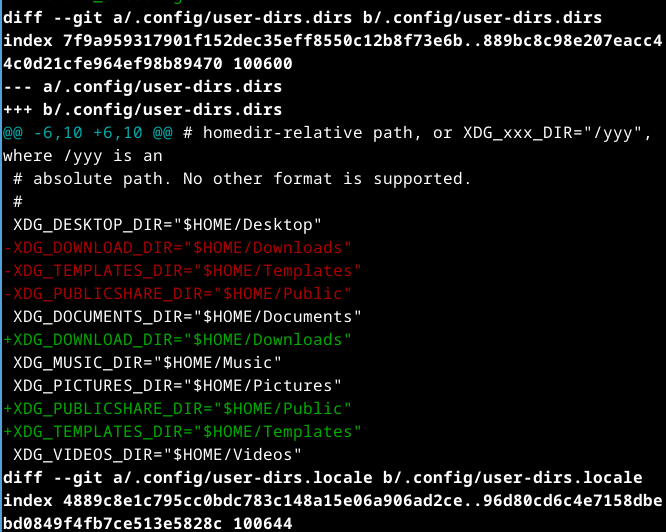{#fig:018 width=70%}

## 6. Установка и настройка chezmoi для управления конфигурационными файлами

Меня устраивают изменения, внесённые chezmoi, я запукаю комманду chezmoi apply -v(рис.19)

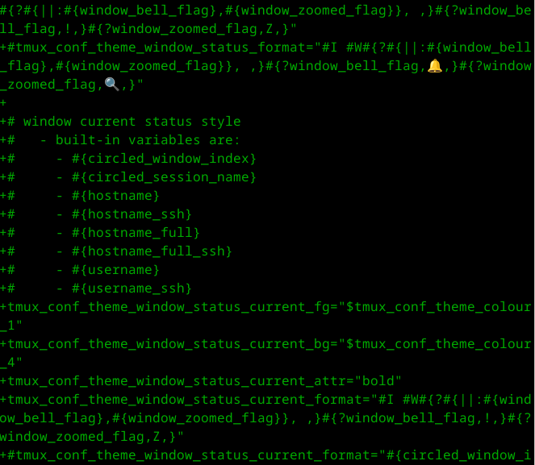{#fig:019 width=70%} 

## 6. Установка и настройка chezmoi для управления конфигурационными файлами

*Использование chezmoi на нескольких машинах*

На второй машине, я инициализирую chezmoi с вашим репозиторием dotfiles(рис.20)

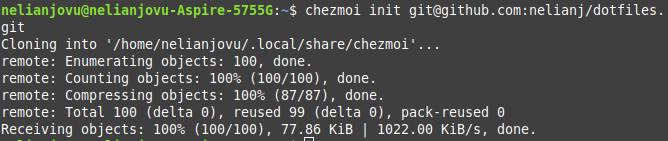{#fig:020 width=70%}

## 6. Установка и настройка chezmoi для управления конфигурационными файлами

Я проверяю, какие изменения внесёт chezmoi в домашний каталог, запустив chezmoi diff(рис.21)

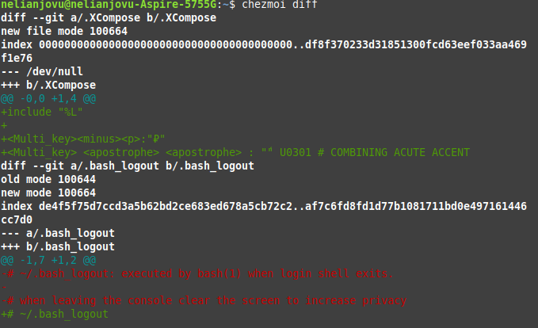{#fig:021 width=70%}

## 6. Установка и настройка chezmoi для управления конфигурационными файлами

Меня устраивают изменения, внесённые chezmoi,поэтому я запукаю комманду chezmoi apply -v(рис.22)

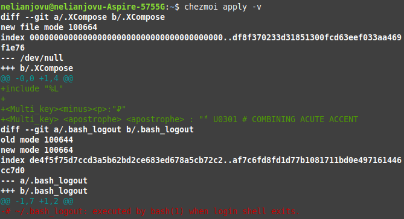{#fig:022 width=70%} 

Если бы меня не устраивают изменения в файле,я бы отредактирую его с помощью chezmoi edit file_name. А после этого применить последние изменения из вашего репозитория с помощью команду chezmoi update -v

## Выводы

Выполняя эту лабораторная работа я научилась создать и настроить систему управления паролями и конфигурационными файлами.

## Список литературы{.unnumbered}

Лабораторная работа № 5
