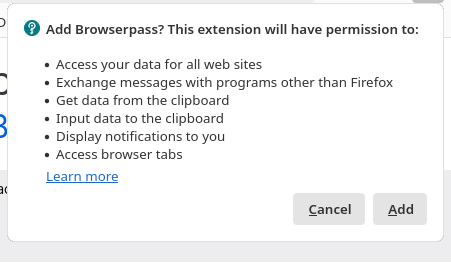

---
## Front matter
title: "Лабораторная работа No5"
subtitle: "Операционные системы"
author: "Нелиа Нджову"

## Generic otions
lang: ru-RU
toc-title: "Содержание"

## Bibliography
bibliography: bib/cite.bib
csl: pandoc/csl/gost-r-7-0-5-2008-numeric.csl

## Pdf output format
toc: true # Table of contents
toc-depth: 2
lof: true # List of figures
lot: true # List of tables
fontsize: 12pt
linestretch: 1.5
papersize: a4
documentclass: scrreprt
## I18n polyglossia
polyglossia-lang:
  name: russian
  options:
	- spelling=modern
	- babelshorthands=true
polyglossia-otherlangs:
  name: english
## I18n babel
babel-lang: russian
babel-otherlangs: english
## Fonts
mainfont: PT Serif
romanfont: PT Serif
sansfont: PT Sans
monofont: PT Mono
mainfontoptions: Ligatures=TeX
romanfontoptions: Ligatures=TeX
sansfontoptions: Ligatures=TeX,Scale=MatchLowercase
monofontoptions: Scale=MatchLowercase,Scale=0.9
## Biblatex
biblatex: true
biblio-style: "gost-numeric"
biblatexoptions:
  - parentracker=true
  - backend=biber
  - hyperref=auto
  - language=auto
  - autolang=other*
  - citestyle=gost-numeric
## Pandoc-crossref LaTeX customization
figureTitle: "Рис."
tableTitle: "Таблица"
listingTitle: "Листинг"
lofTitle: "Список иллюстраций"
lotTitle: "Список таблиц"
lolTitle: "Листинги"
## Misc options
indent: true
header-includes:
  - \usepackage{indentfirst}
  - \usepackage{float} # keep figures where there are in the text
  - \floatplacement{figure}{H} # keep figures where there are in the text
---

# Цель работы

Создать и настроить систему управления паролями и конфигурационными файлами

# Задание

1. Установка менеджера паролей pass

2. Настройка

3. Настройка интерфейса с броузером

4. Сохранение пароля

5. Управление файлами конфигурации

6. Установка и настройка chezmoi для управления конфигурационными файлами 

# Выполнение лабораторной работы

**1. Установка менеджера паролей pass**

Я устанавливаю pass.Менеджер паролей pass — программа, сделанная в рамках идеологии Unix.Также носит название стандартного менеджера паролей для Unix (рис.1)

{#fig:001 width=70%}

Потом устанавливаю gopass(рис.2)

{#fig:001 width=70%}

**2. Настройка**

Просиотрю списка ключи gpg.Файлы шифруются с помощью GPG-ключа.(рис.3)

{#fig:001 width=70%}

Я инициализацию хранилище(рис.4)

{#fig:001 width=70%}

Я создаю структуру git с помощью комманду pass git init(рис.5)

{#fig:001 width=70%}

**3. Настройка интерфейса с броузером**

Я устанавливаю плагин(рис.6)

{#fig:001 width=70%}

Для взаимодействия с броузером используется интерфейс native messaging.Поэтому кроме плагина к броузеру, устанавливаю программа, обеспечивающая интерфейс native messaging(рис.7 и рис.8)

{#fig:001 width=70%}

{#fig:001 width=70%}

**4. Сохранение пароля**

Я Добавляю новый пароль, выполнив комманду pass insert lab5/lab5.txt(рис.9)

{#fig:001 width=70%}

Я отображаю пароль для указанного имени файла(рис.10)

{#fig:001 width=70%}

После этого я заменяю существующий пароль(рис.11)

{#fig:001 width=70%}

**5. Управление файлами конфигурации**

Я установливаю дополнительное программное обеспечение(рис.12)

{#fig:001 width=70%}

Я установливаю шрифты(рис.13, рис.14 и рис.15)

{#fig:001 width=70%}

{#fig:001 width=70%}

{#fig:001 width=70%}

**6. Установка и настройка chezmoi для управления конфигурационными файлами**

Я установливаю бинарный файл chezmoi.chezmoi используется для управления файлами конфигурации домашнего каталога пользователя. Скрипт определяет архитектуру процессора и операционную систему и скачивает необходимый файл(рис.16)

{#fig:001 width=70%}

Использование утилиты командной строки для работы с github, я создаю свой репозиторий для конфигурационных файлов на основе шаблона(рис.17)

{#fig:001 width=70%}

Я инициализирую chezmoi с моем репозиторием dotfiles(рис.18)

{#fig:001 width=70%}

Я проверяю, какие изменения внесёт chezmoi в домашний каталог, запустив chezmoi diff(рис.19)

{#fig:001 width=70%}

Меня устраивают изменения, внесённые chezmoi, я запукаю комманду chezmoi apply -v(рис.20)

{#fig:001 width=70%} 

*Использование chezmoi на нескольких машинах*

На второй машине, я инициализирую chezmoi с вашим репозиторием dotfiles(рис.21)

{#fig:001 width=70%}

Я проверяю, какие изменения внесёт chezmoi в домашний каталог, запустив chezmoi diff(рис.22)

{#fig:001 width=70%}

Меня устраивают изменения, внесённые chezmoi,поэтому я запукаю комманду chezmoi apply -v(рис.23)

{#fig:001 width=70%} 

Если бы меня не устраивают изменения в файле,я бы отредактирую его с помощью chezmoi edit file_name. А после этого применить последние изменения из вашего репозитория с помощью команду chezmoi update -v

# Выводы

Выполняя эту лабораторная работа я научилась создать и настроить систему управления паролями и конфигурационными файлами.

# Список литературы{.unnumbered}

Лабораторная работа № 5
