---
## Front matter
lang: ru-RU
title: Лабораторная работа No6
subtitle: Операционные системы
author:
  - Нджову Н.
institute:
  - Российский университет дружбы народов, Москва, Россия
date: 15 марта 2024

## i18n babel
babel-lang: russian
babel-otherlangs: english

## Formatting pdf
toc: false
toc-title: Содержание
slide_level: 2
aspectratio: 169
section-titles: true
theme: metropolis
header-includes:
 - \metroset{progressbar=frametitle,sectionpage=progressbar,numbering=fraction}
 - '\makeatletter'
 - '\beamer@ignorenonframefalse'
 - '\makeatother'
---

## Цель работы

Приобретение практических навыков взаимодействия пользователя с системой посредством командной строки.

## Задание

1. Определите полное имя вашего домашнего каталога.

2. Выполните следующие действия:

 - Перейдите в каталог /tmp.

 - Выведите на экран содержимое каталога /tmp.

 - Определите, есть ли в каталоге /var/spool подкаталог с именем cron?

 - Перейдите в Ваш домашний каталог и выведите на экран его содержимое.

3. Выполните следующие действия:

 - В домашнем каталоге создайте новый каталог с именем newdir.

 - В каталоге ~/newdir создайте новый каталог с именем morefun.

## Задание

 - В домашнем каталоге создайте одной командой три новых каталога с именами letters, memos, misk. Затем удалите эти каталоги одной командой.

 - Попробуйте удалить ранее созданный каталог ~/newdir командой rm. Проверьте, был ли каталог удалён.

 - Удалите каталог ~/newdir/morefun из домашнего каталога. Проверьте, был ли каталог удалён.

4. С помощью команды man определите, какую опцию команды ls нужно использовать для просмотра содержимое не только указанного каталога, но и подкаталогов, входящих в него.

## Задание

5. С помощью команды man определите набор опций команды ls, позволяющий отсортировать по времени последнего изменения выводимый список содержимого каталога с развёрнутым описанием файлов.

6. Используйте команду man для просмотра описания следующих команд: cd, pwd, mkdir, rmdir, rm. Поясните основные опции этих команд.

7. Используя информацию, полученную при помощи команды history, выполните модификацию и исполнение нескольких команд из буфера команд

## Выполнение лабораторной работы

Я определяю полное имя домашнего каталога с помощью команду pwd(рис.1)

{#fig:001 width=70%}

## Выполнение лабораторной работы

Я перехожу в каталог tmp использование команда cd(рис.2)

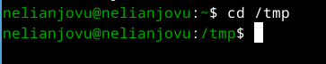{#fig:002 width=70%}

## Выполнение лабораторной работы

Я просматриваю содержимое каталога tmp с помощью команду ls без ключа(рис.3)

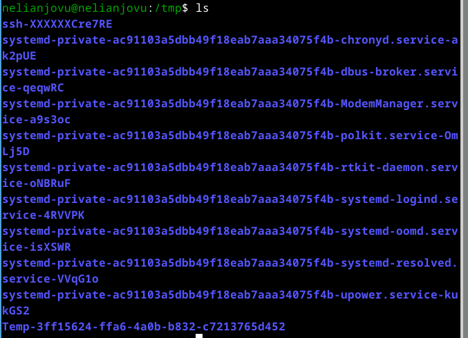{#fig:003 width=70%}

## Выполнение лабораторной работы

Теперь просматриваю содержимое каталога tmp с помощью комманду ls с разными опциями. Опция -l показывает допольнительну информацию о файлах в каталоге(время создания, владельца, права)(рис.4)

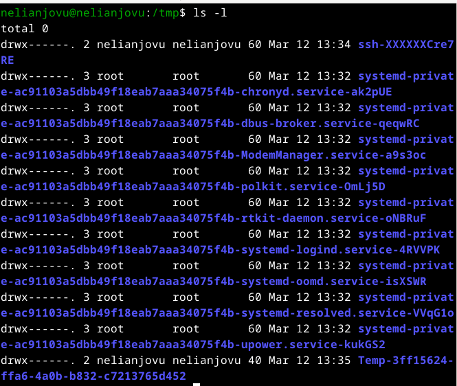{#fig:004 width=70%}

## Выполнение лабораторной работы

Опция -а показывает скрытие файлы в каталоге(рис.5)

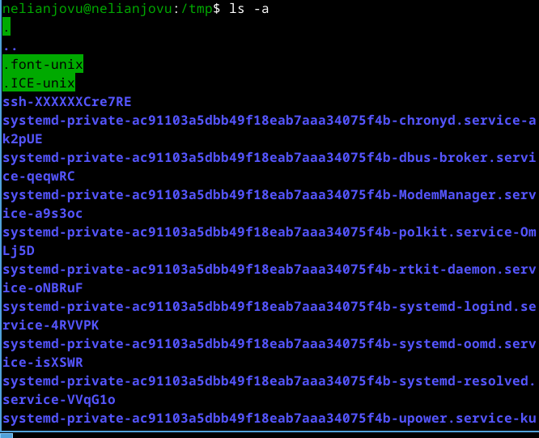{#fig:005 width=70%}

## Выполнение лабораторной работы

Я перехожу в каталоге /var/spool, чтобы определить, есть ли в каталоге подкаталог с соответсвующим именем, я использую команду ls с флагом -F. Опция F показывается все подкаталоги в каталоге, в котором вы находитесь(рис.6)

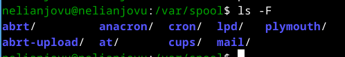{#fig:006 width=70%}

## Выполнение лабораторной работы

Я возвращаюсь в домашний каталог, запустив cd и проверяю содержимое каталога с помощью команду ls c опции -аlF(рис.7)

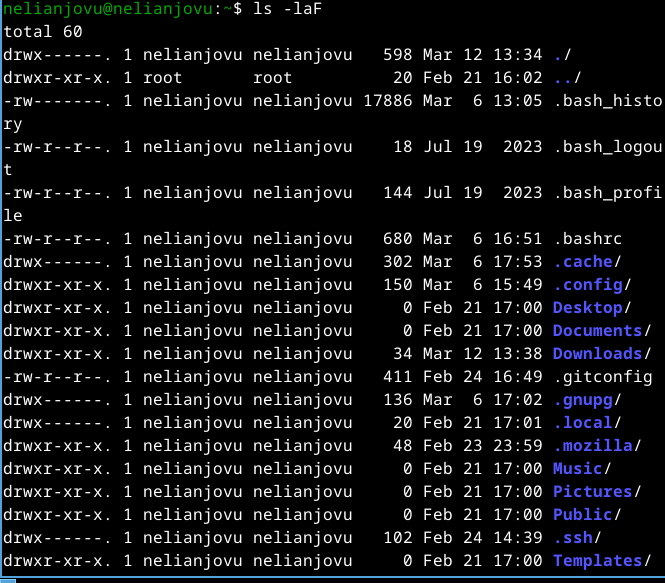{#fig:007 width=70%}

## Выполнение лабораторной работы

Я создаю новый каталог newdir с помощью команду mkdir, перехожу в только созданую каталог и создать ещё новый каталог под названием morefun(рис.8)

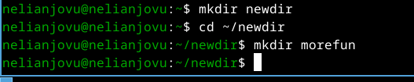{#fig:008 width=70%}

## Выполнение лабораторной работы

Я создаю несколько каталоги с одном командом. Чтобы делать это с одной строчкой нужно перечислить названия каталога через пробел после команду mkdir. После этого проверяю если каталоги созданы(рис.9)

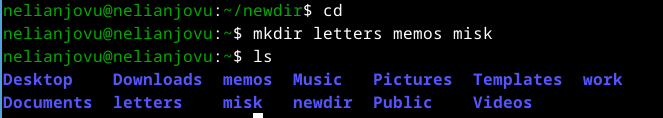{#fig:009 width=70%}

## Выполнение лабораторной работы

Я удаляю несколько каталоги с одном командом.Чтобы делать это с одной строчкой нужно перечислить названия каталога через пробел после команду rm с флагом -r. После этого проверяю если каталоги удалёны(рис.10)

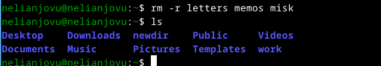{#fig:010 width=70%}

## Выполнение лабораторной работы

Я попробовала удалить ~/newdir с командой rm но не получилась потому что rm удаляет файлы, чтобы она удаляет не пустый каталог нужно добавить опции для рекурсивного удаления -r(рис.11)

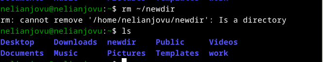{#fig:011 width=70%}

## Выполнение лабораторной работы

Я удаляю каталог newdir с помощью команду rm с флагом -r, потом проверяю если удаляется(рис.12)

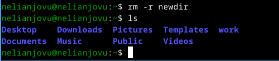{#fig:012 width=70%}

## Выполнение лабораторной работы

С помощью команды man я определяю, какую опцию команды ls нужно использовать для просмотра содержимое не только указанного каталога, но и подкаталогов,входящих в него(рис.13)

{#fig:013 width=70%}

## Выполнение лабораторной работы

С помощью команды man тоже определяю набор опций команды ls, позволяющий отсортировать по времени последнего изменения выводимый список содержимого каталога с развёрнутым описанием файлов(рис.14)

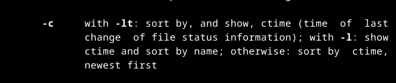{#fig:014 width=70%}

## Выполнение лабораторной работы

Я использую команду man для просмотра описания следующих команд:

1. cd: -p - позволяет следовать по символически ссылки перед тем, как обработаны все переходы. -L - переходит по символическим ссылкам только после того, как обработаны все переходы. -e - позволяет выйти с ошибкой, если директория, в которую нужно перейти не найдена(рис.15)

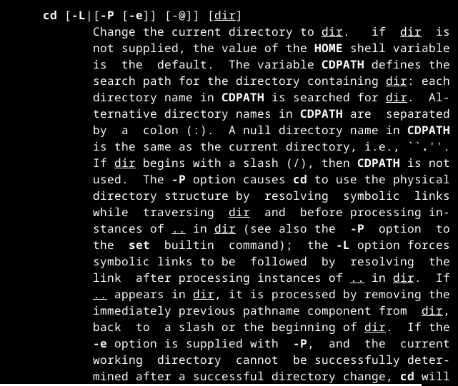{#fig:015 width=70%}

## Выполнение лабораторной работы

2. pwd: -L - брать директорию из переменной окружения, даже если она содержит символические ссылки. -P - отбрасывать все символические ссылки(рис.16)

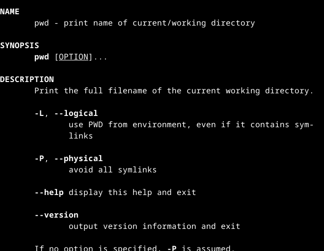{#fig:016 width=55%}

## Выполнение лабораторной работы

3. mkdir: -m - устанавливает права доступа создаваемой директории как chmod, синтаксис тоже как у chmod. -p - позволяет рекурсивно создавать директории и их подкаталоги. -v - выводи сообщение о созданных директориях. -z - установить контекст SELinux для создаваемой директории по умолчанию. -context - установить контекст SELinux для создаваемой директории в значении CTX(рис.17)

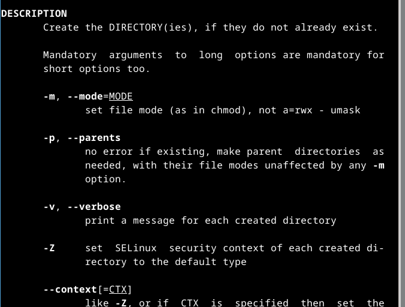{#fig:017 width=55%}

## Выполнение лабораторной работы

4. rmdir: -ignore-fail-on-non-empty - отменяет вывод ошибки, если каталог не пустой, просто его игнорирует. -р - удаляет рекурсивно каталог, если они все содержат в себе только удаляемый каталог. -v - выводить сообщение о каждом удалении директории(рис.18)

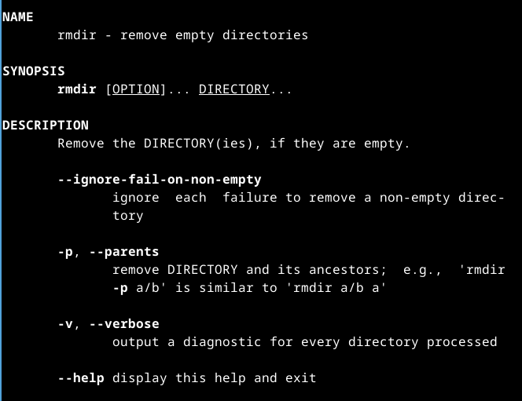{#fig:018 width=55%}
  
## Выполнение лабораторной работы

5. rm: -f - игнорировать несуществующие файлы или аргументы, никогда не выводить запрос на подтверждение удаление. -i - выводить запрос на подтверждение удаления каждого файла. -l - вывести запрос на подтверждение удаления один раз, для всех файлов, если удаляется больше 3-х файлов или идет рекурсивное удаление. -interactive - заменяет предыдущие три опции, можно выбрать одну из них. -one-file-system - во время рекурсивного удаления пропускать директории из других файловых систем. -no-preserve-root - если в качестве дироктории задана корневая, то считать что это обычная директория и начать удаление. -r или -R - удаляет директории их содержимое рекурсивно. -d или -dir - удаляет пустые директории. -v - прописывает все действия команды(рис.19)

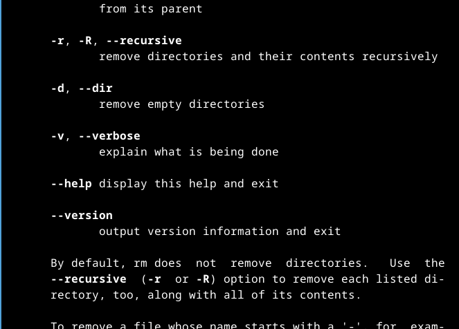{#fig:019 width=55%}

## Выполнение лабораторной работы

Вывела историю команд с помощь команду history(рис.20)

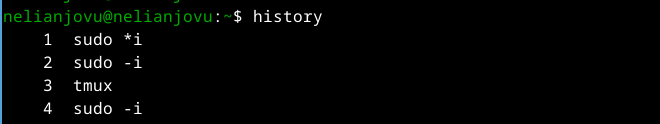{#fig:020 width=70%}

Модифицировала команду(рис.21)

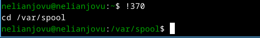{#fig:021 width=70%}

## Выводы

Выполняя эту лабораторную работу я Приобрела практических навыков взаимодействия пользователя с системой посредством командной строки.

## Список литературы{.unnumbered}

Лабораторная работа № 6
