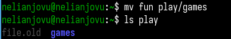

---
## Front matter
lang: ru-RU
title: Презентация по лабораторной работе No7
subtitle: Операционные системы
author:
  - Нджову Н.
institute:
  - Российский университет дружбы народов, Москва, Россия
date: 20 марта 2024

## i18n babel
babel-lang: russian
babel-otherlangs: english

## Formatting pdf
toc: false
toc-title: Содержание
slide_level: 2
aspectratio: 169
section-titles: true
theme: metropolis
header-includes:
 - \metroset{progressbar=frametitle,sectionpage=progressbar,numbering=fraction}
 - '\makeatletter'
 - '\beamer@ignorenonframefalse'
 - '\makeatother'
---

## Цель работы

Ознакомление с файловой системой Linux, её структурой, именами и содержанием каталогов. Приобретение практических навыков по применению команд для работы с файлами и каталогами, по управлению процессами (и работами), по проверке использования диска и обслуживанию файловой системы.

## Задание

1. Выполнить все примеры из лабораторной работы

2. Выполнить команды по копирование,создание и перемещение файлов и каталогов

3. Определить опции команды chmod

4. Изменить права доступа к файлам

5. Прочитать документацию о командах mount,fsck,mkfs,kill

## 1. Выполнить все примеры из лабораторной работы

Я создаю новый файл abc1 и копирую его в файл  april и в файл may.Потом я проверяю, что все команды выполнены правлино(рис.1)

{#fig:001 width=70%}

## 1. Выполнить все примеры из лабораторной работы

Я создаю новую папку monthly, я копирую файл april и may в только созданную папку и проверяю если это сделаны правилно(рис.2)

{#fig:002 width=70%} 

## 1. Выполнить все примеры из лабораторной работы

Я копирую файл monthly/may в файл с именем june(рис.3)

{#fig:003 width=70%}

## 1. Выполнить все примеры из лабораторной работы

Я создаю новый каталог monthly.00 и копирую каталог monthly в каталог monthly.00(рис.4)

{#fig:004 width=70%}

## 1. Выполнить все примеры из лабораторной работы

Я копирую каталог monthly.00 в каталоге /tmp(рис.5)

{#fig:005 width=70%}

## 1. Выполнить все примеры из лабораторной работы

Я переименовываю файл april в july(рис.6)

{#fig:006 width=70%}

## 1. Выполнить все примеры из лабораторной работы

Я перемещаю файл july в каталог monthly.00(рис.7)

{#fig:007 width=70%}

## 1. Выполнить все примеры из лабораторной работы

Я переименовываю каталог monthly.00 в monthly.01 и создаю новый каталог reports(рис.8)

{#fig:008 width=70%}

## 1. Выполнить все примеры из лабораторной работы

Я перемещаю каталог monthly.01 в каталог reports

Я переименовывю каталог report/monthly.01 в report/monthly(рис.9)

{#fig:009 width=70%}

## 1. Выполнить все примеры из лабораторной работы

Я проверяю права у файла may, изменяю права доступа, добавляя создателю можно выполнять файл(рис.10)

{#fig:010 width=70%}

## 1. Выполнить все примеры из лабораторной работы

Я лишаю владельца файла ~/may права на выполнение(рис.11)

{#fig:011 width=70%}

## 1. Выполнить все примеры из лабораторной работы

Я меняю права доступа к каталогу monthly, группы и другие пользователи не смогу его прочитать(рис.12)

{#fig:012 width=70%}

Я меняю права доступа к файлу abc1, группы могут писать в этом файле

## 2. Выполнить команды по копирование,создание и перемещение файлов и каталогов

Я копирую файл /usr/include/sys/io.h в домашний каталог и назову его equipment(рис.13)

{#fig:013 width=70%}

## 2. Выполнить команды по копирование,создание и перемещение файлов и каталогов

Я создаю новый каталог в домашнем каталоге ~/ski.plases

Я перемещаю файл equipment в каталог ~/ski.plases(рис.14)

{#fig:014 width=70%}

## 2. Выполнить команды по копирование,создание и перемещение файлов и каталогов

Я переименовываю файл ~/ski.plases/equipment в ~/ski.plases/equiplist

Я копирую файла abc1 в каталог ~/ski.plases, назову его equiplist2(рис.15)

{#fig:015 width=70%}

## 2. Выполнить команды по копирование,создание и перемещение файлов и каталогов

Я создаю каталог с именем equipment в каталоге ~/ski.plases

Я перемещаю файлы ~/ski.plases/equiplist и equiplist2 в каталог ~/ski.plases/equipment

Я создаю каталог ~/newdir, перемещаю его в каталог ~/ski.plases и назову его plans(рис.16)

{#fig:016 width=70%}

## 3. Определить опции команды chmod

*Я определяю опции команды chmod, необходимые для того, чтобы присвоить перечисленным ниже файлам выделенные права доступа, считая, что в начале таких прав нет:*

Сначала я создаю каталог australia и добавляю права доступа drwxr--r--(рис.17)

{#fig:017 width=70%}

## 3. Определить опции команды chmod

Я создаю каталог play и добавляю права доступа drwx--x--x (рис.18)

{#fig:018 width=70%}

## 3. Определить опции команды chmod

Я создаю файл my_os и добавляю права доступа -r-xr--r--(рис.19)

{#fig:019 width=70%}

## 3. Определить опции команды chmod

Я создаю файл feathers и добавляю права доступа -rw-rw-r--(рис.20)

{#fig:020 width=70%}

## 4. Изменить права доступа к файлам

Я просморю содержимое в файл ~/.password-store(рис.21)

{#fig:021 width=70%}

## 4. Изменить права доступа к файлам

Я копирую файл ~/feathers в файл ~/file.old

Я перемещаю файл ~/file.old в каталог ~/play(рис.22)

{#fig:022 width=70%}

## 4. Изменить права доступа к файлам

Я копирую каталог ~/play в каталог ~/fun

Я перемещаю каталог ~/fun в каталог ~/play и назову его games(рис.23)

{#fig:023 width=70%}

## 4. Изменить права доступа к файлам

Я меняю права доступа файла ~/feathers, владельца не могут читать файл

Когда я пытаюсь его открыть, он выдает ошибку, потому что у меня нет прав на чтение(рис.24)

{#fig:024 width=70%}

То же самое происходит, когда я пытаюсь скопировать его

Я даю владельцу файла ~/feathers право на чтение

## 4. Изменить права доступа к файлам

Я меняю права доступа каталог ~/play, владельца нет права выполнение

Когда я пытаюсь вхожу в каталог ~/play, он выдает ошибки, потому что у меня нет прав на выполнение(рис.25)

{#fig:025 width=70%}

## 4. Изменить права доступа к файлам

Я меняю права доступа каталог ~/play, у владельцы есть права выполнение(рис.26)

{#fig:026 width=55%}

## 5. Прочитать документацию о командах mount,fsck,mkfs,kill

Я прочитаю описание каждой из четырех команд с помощью man(рис.27):

mount - это утилита командой строки в UNIX-подобных операционных системых. Она используетсядля монтирования файловых систем

fsck(проверка файловой системы) - это утилита командой строки, которая позволяет выполнять проверку согласованности и интерактивное исправление в одной или нескольких файловых системах Linux. Она использует программы, специфичные для типа проверяемой файловой системы

mkfs используется для создания файловой системы Linux на некотором устройстве, обычно в разделе жесткого диска. Аргументом filesys для файловой системы может быьт либо имя устройства

## 5. Прочитать документацию о командах mount,fsck,mkfs,kill

Команд kill отправляет указанный сигнал указанному процессу. Если сигнал не указан, отправляется сигнал SIGTERM.Сигнал SIGTERM завершает работу только теч процессов, которые не обрабатывают его поступление. Для других процессов может потребоваться отправить сигнал SIGKILL, поскольку этот сигнал невозможно перехватить

{#fig:027 width=70%}

## Выводы

При выполнении данной лабораторной работы я ознакомилась с файловой системой Linux, её структурой, именами и содержанием каталогов. Приобрела практические навыки по применению команд для работы с файлами и каталогами, по управлению процессами (и работами), по проверке использования диска и обслуживанию файловой системы

