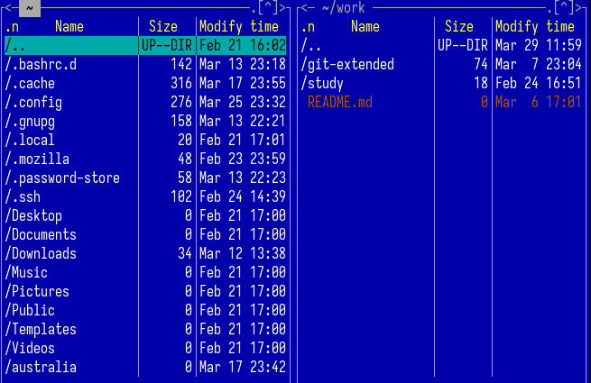
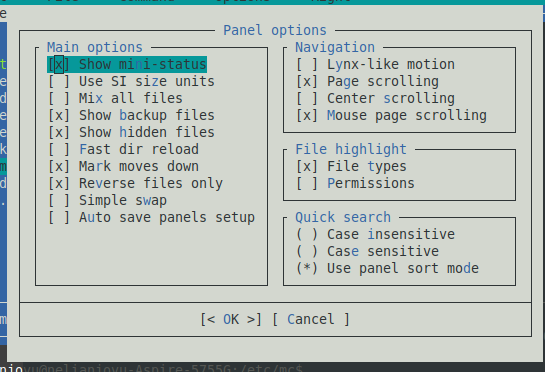

---
## Front matter
lang: ru-RU
title: Презентация по лабораторной работе No9
subtitle: Операционные системы
author:
  - Нджову Н.
institute:
  - Российский университет дружбы народов, Москва, Россия
date: 05 Апреля 2024

## i18n babel
babel-lang: russian
babel-otherlangs: english

## Formatting pdf
toc: false
toc-title: Содержание
slide_level: 2
aspectratio: 169
section-titles: true
theme: metropolis
header-includes:
 - \metroset{progressbar=frametitle,sectionpage=progressbar,numbering=fraction}
 - '\makeatletter'
 - '\beamer@ignorenonframefalse'
 - '\makeatother'
---

## Цель работы

Освоение основных возможностей командной оболочки Midnight Commander. Приобретение навыков практической работы по просмотру каталогов и файлов; манипуляций с ними.

## Задание

1. Задание по mc

2. Задание по встроенному редактору mc

## 1. Задание по mc

Я использую команда man и прочитаю информацию о mc(рис.1)

{#fig:001 width=70%}

## 1. Задание по mc

Я запускаю из командой строки mc и изучаю его структуру и меню(рис.2)

{#fig:002 width=70%}

## 1. Задание по mc

Я перемещась по директориями с помощью стрелочек влево вправо, перебрать файлы в директории с помощью стрелочек вверх вниз(рис.3)

{#fig:003 width=70%}

## 1. Задание по mc

Я могу копировать файл с помощью F5(рис.4)

{#fig:004 width=70%}

## 1. Задание по mc

Можно получить информаций о правах на файл и информации о нем, используя меню(рис.5)

{#fig:005 width=70%}

## 1. Задание по mc

Я выведу информанцию о файле в меню правой панели, я получаю информацию больше чем когда использую команд ls -l(рис.6)

{#fig:006 width=70%}

## 1. Задание по mc

*Используя возможности подменю "Файл":*

Я просмотрю содержимое текстового файла(рис.7)

{#fig:007 width=70%}

## 1. Задание по mc

Я открываю на изменение и пишу одно строку, а потом закрываю файл без сохранения(рис.8)

{#fig:008 width=70%}

## 1. Задание по mc

Я создаю новый каталог(рис.9)

{#fig:009 width=70%}

## 1. Задание по mc

Я копирую файл в только созданную каталогу(рис.10)

{#fig:010 width=70%}

## 1. Задание по mc

*С помощью соответствующих средств подменю "Команда":*

Я могу найти с заданными условием, я искала файлы формата .cpp(рис.11)

{#fig:011 width=70%} 

## 1. Задание по mc

Я могу повторить одной из предыдущих команд(рис.12)

{#fig:012 width=70%}

## 1. Задание по mc 

Я перехожу в домашний каталог(рис.13)

{#fig:013 width=70%}

## 1. Задание по mc 

Я анализирую файла меню и файла расширений(рис.14 и рис 15)

{#fig:014 width=70%}

{#fig:015 width=70%}

## 1. Задание по mc

Я вызываю подменю Настройки, освоить операции, определяющие структуру экрана mc(рис.16 и рис.17)

{#fig:016 width=70%}

## 1. Задание по mc

{#fig:017 width=70%}

## 2. Задание по встроенному редактору mc

Я создаю файл text.txt с помощью команду touch(рис.18)

{#fig:018 width=70%}

## 2. Задание по встроенному редактору mc

Я открываю созданный файл для запись с помощью F4 и добавляю а него текст(рис.19)

{#fig:019 width=70%}

## 2. Задание по встроенному редактору mc

*Используя горячие клавиши, я делаю текстом следующие манипуляции:*

Я выделяю текст с помощью клавиши F3 и мышью, потом я удаляю выделенный текст(рис.20)

{#fig:020 width=70%}

## 2. Задание по встроенному редактору mc

Я выделяю фрагмент текста и скопирую его на новую строку(рис.21)

{#fig:021 width=70%}

## 2. Задание по встроенному редактору mc

Я выделяю фрагмент текста и перемещаю его на новую строку(рис.22)

{#fig:022 width=70%}

## 2. Задание по встроенному редактору mc

Я сохраняю файл(рис.23)

{#fig:023 width=70%}

## 2. Задание по встроенному редактору mc

С помощью Pg Dn, я перехожу в конец файла и пишу некоторый текст(рис.24)

{#fig:024 width=70%}

## 2. Задание по встроенному редактору mc

С помощью Pg Up, я перехожу в начало файла и пишу некоторый текст. После этого я сохраняю и закрываю файл(рис.25)

{#fig:025 width=70%}

## 2. Задание по встроенному редактору mc

Я открываю файл с исходным текстом на некотором языке программирования cpp(рис.26)

{#fig:026 width=70%}

## 2. Задание по встроенному редактору mc

Я использую меню редактора, выключaю подсветку синтаксиса(рис.27)

{#fig:027 width=70%}

## Выводы

Выпоняя эту лабораторную работу, я освоила основные возможности командной оболочки Midnight Commander, приобрела навыков практической работы по просмотру каталогов и файлов; манипуляций с ними.
