---
## Front matter
title: "Отчет по лабораторной работе No9"
subtitle: "Операционные системы"
author: "Нелиа Нджову"

## Generic otions
lang: ru-RU
toc-title: "Содержание"

## Bibliography
bibliography: bib/cite.bib
csl: pandoc/csl/gost-r-7-0-5-2008-numeric.csl

## Pdf output format
toc: true # Table of contents
toc-depth: 2
lof: true # List of figures
lot: true # List of tables
fontsize: 12pt
linestretch: 1.5
papersize: a4
documentclass: scrreprt
## I18n polyglossia
polyglossia-lang:
  name: russian
  options:
	- spelling=modern
	- babelshorthands=true
polyglossia-otherlangs:
  name: english
## I18n babel
babel-lang: russian
babel-otherlangs: english
## Fonts
mainfont: PT Serif
romanfont: PT Serif
sansfont: PT Sans
monofont: PT Mono
mainfontoptions: Ligatures=TeX
romanfontoptions: Ligatures=TeX
sansfontoptions: Ligatures=TeX,Scale=MatchLowercase
monofontoptions: Scale=MatchLowercase,Scale=0.9
## Biblatex
biblatex: true
biblio-style: "gost-numeric"
biblatexoptions:
  - parentracker=true
  - backend=biber
  - hyperref=auto
  - language=auto
  - autolang=other*
  - citestyle=gost-numeric
## Pandoc-crossref LaTeX customization
figureTitle: "Рис."
tableTitle: "Таблица"
listingTitle: "Листинг"
lofTitle: "Список иллюстраций"
lotTitle: "Список таблиц"
lolTitle: "Листинги"
## Misc options
indent: true
header-includes:
  - \usepackage{indentfirst}
  - \usepackage{float} # keep figures where there are in the text
  - \floatplacement{figure}{H} # keep figures where there are in the text
---

# Цель работы

Освоение основных возможностей командной оболочки Midnight Commander. Приобретение навыков практической работы по просмотру каталогов и файлов; манипуляций с ними.

# Задание

1. Задание по mc

2. Задание по встроенному редактору mc

# Выполнение лабораторной работы

**1. Задание по mc**

Я использую команда man и прочитаю информацию о mc(рис.1)

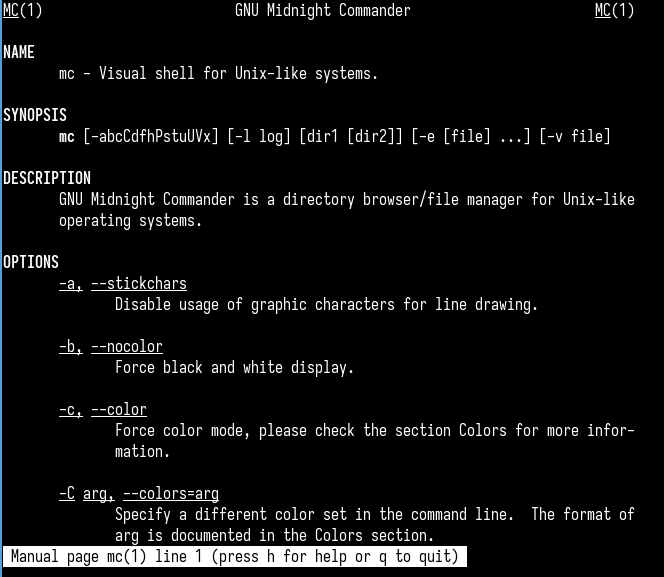{#fig:001 width=70%}

Я запускаю из командой строки mc и изучаю его структуру и меню(рис.2)

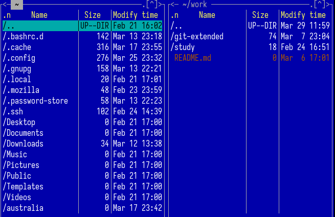{#fig:001 width=70%}

Я перемещась по директориями с помощью стрелочек влево вправо, перебрать файлы в директории с помощью стрелочек вверх вниз(рис.3)

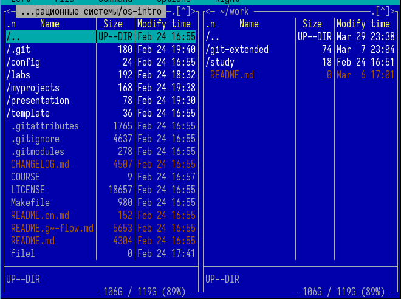{#fig:001 width=70%}

Я могу копировать файл с помощью F5(рис.4)

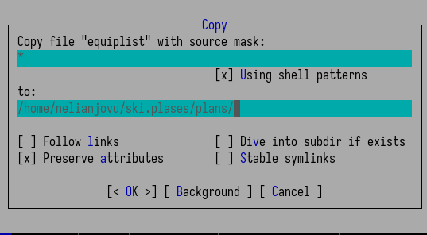{#fig:001 width=70%}

Можно получить информаций о правах на файл и информации о нем, используя меню(рис.5)

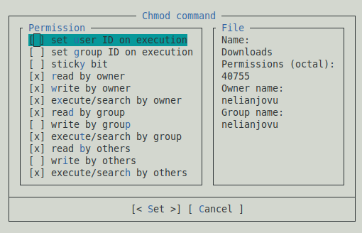{#fig:001 width=70%}

Я выведу информанцию о файле в меню правой панели, я получаю информацию больше чем когда использую команд ls -l(рис.6)

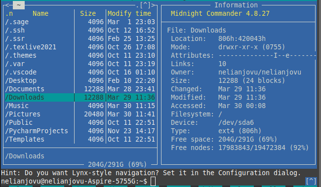{#fig:001 width=70%}

*Используя возможности подменю "Файл":*

Я просмотрю содержимое текстового файла(рис.7)

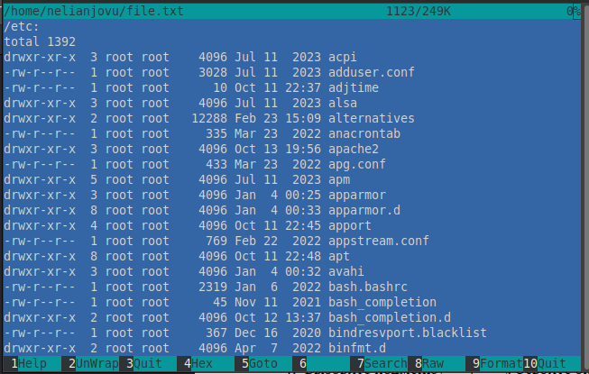{#fig:001 width=70%}

Я открываю на изменение и пишу одно строку, а потом закрываю файл без сохранения(рис.8)

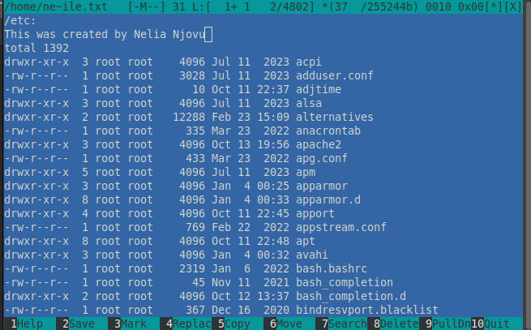{#fig:001 width=70%}

Я создаю новый каталог(рис.9)

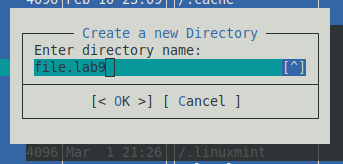{#fig:001 width=70%}

Я копирую файл в только созданную каталогу(рис.10)

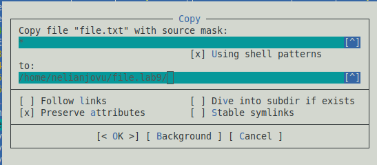{#fig:001 width=70%}

*С помощью соответствующих средств подменю "Команда":*

Я могу найти с заданными условием, я искала файлы формата .cpp(рис.11)

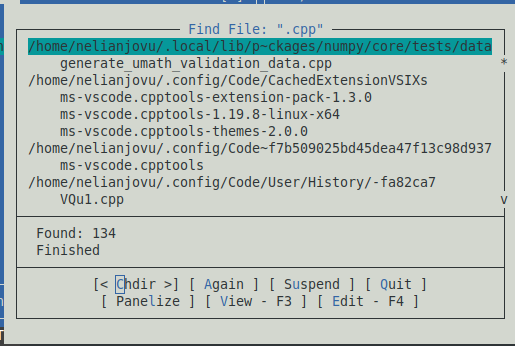{#fig:001 width=70%} 

Я могу повторить одной из предыдущих команд(рис.12)

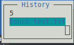{#fig:001 width=70%} 

Я перехожу в домашний каталог(рис.13)

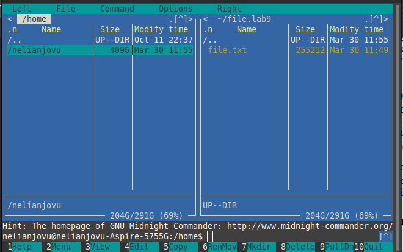{#fig:001 width=70%} 

Я анализирую файла меню и файла расширений(рис.14 и рис 15)

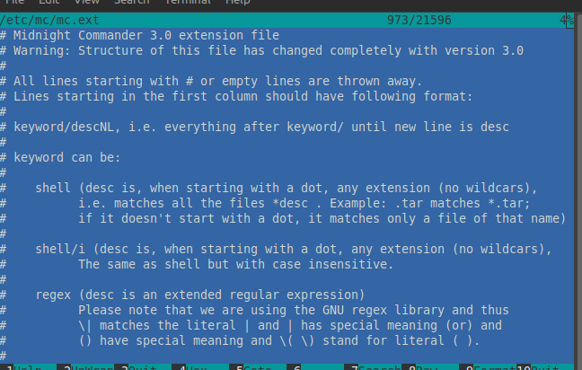{#fig:001 width=70%}

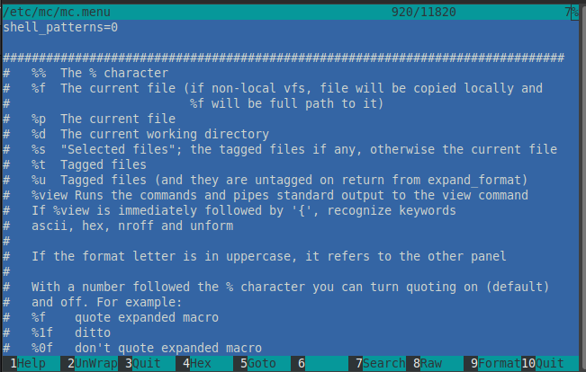{#fig:001 width=70%}

Я вызываю подменю Настройки, освоить операции, определяющие структуру экрана mc(рис.16 и рис.17)

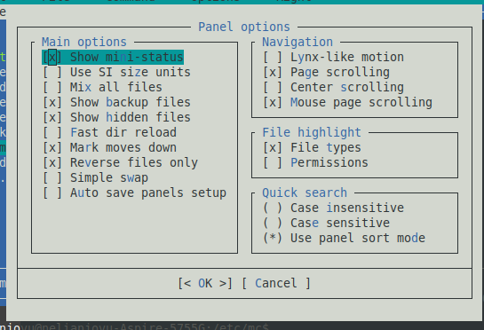{#fig:001 width=70%}

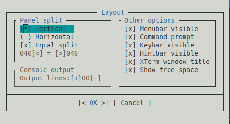{#fig:001 width=70%}

**2. Задание по встроенному редактору mc**

Я создаю файл text.txt с помощью команду touch(рис.18)

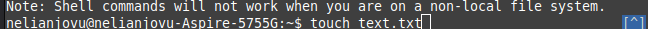{#fig:001 width=70%}

Я открываю созданный файл для запись с помощью F4 и добавляю а него текст(рис.19)

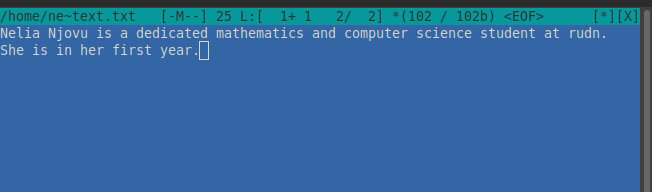{#fig:001 width=70%}

*Используя горячие клавиши, я делаю текстом следующие манипуляции:*

Я выделяю текст с помощью клавиши F3 и мышью, потом я удаляю выделенный текст(рис.20)

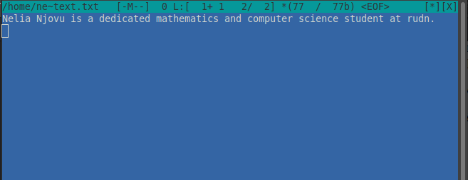{#fig:001 width=70%}

Я выделяю фрагмент текста и скопирую его на новую строку(рис.21)

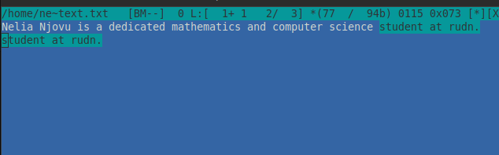{#fig:001 width=70%}

Я выделяю фрагмент текста и перемещаю его на новую строку(рис.22)

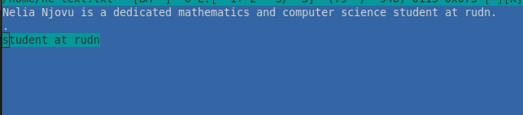{#fig:001 width=70%}

Я сохраняю файл(рис.23)

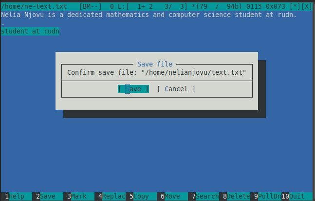{#fig:001 width=70%}

С помощью Pg Dn, я перехожу в конец файла и пишу некоторый текст(рис.24)

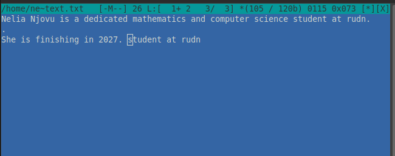{#fig:001 width=70%}

С помощью Pg Up, я перехожу в начало файла и пишу некоторый текст. После этого я сохраняю и закрываю файл(рис.25)

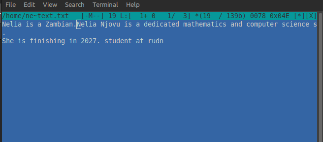{#fig:001 width=70%}

Я открываю файл с исходным текстом на некотором языке программирования cpp(рис.26)

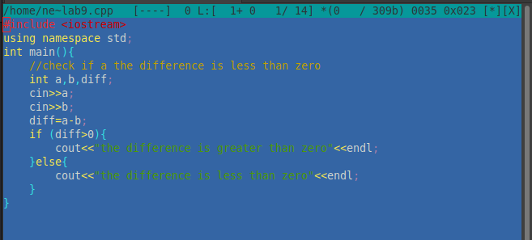{#fig:001 width=70%}

Я использую меню редактора, выключaю подсветку синтаксиса(рис.27)

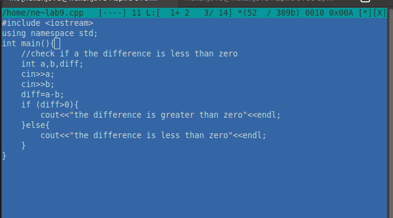{#fig:001 width=70%}

# Выводы

Выпоняя эту лабораторную работу, я освоила основные возможности командной оболочки Midnight Commander, приобрела навыков практической работы по просмотру каталогов и файлов; манипуляций с ними.

# Список литературы{.unnumbered}

Лабораторная работа No9
