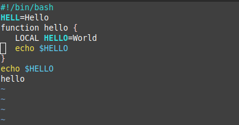
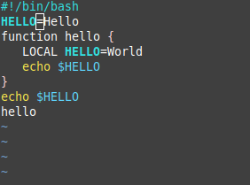
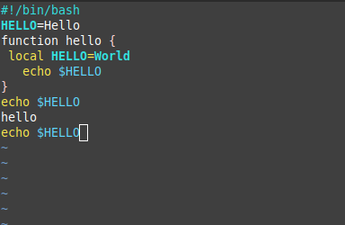

---
## Front matter
lang: ru-RU
title: Презентация по Лабораторной работе No10
subtitle: Операционные системы
author:
  - Нджову Н.
institute:
  - Российский университет дружбы народов, Москва, Россия
date: 11 АПРЕЛЯ 2024

## i18n babel
babel-lang: russian
babel-otherlangs: english

## Formatting pdf
toc: false
toc-title: Содержание
slide_level: 2
aspectratio: 169
section-titles: true
theme: metropolis
header-includes:
 - \metroset{progressbar=frametitle,sectionpage=progressbar,numbering=fraction}
 - '\makeatletter'
 - '\beamer@ignorenonframefalse'
 - '\makeatother'
---

## Цель работы

Познакомиться с операционной системой Linux. Получить практические навыки работы с редактором vi, установленным по умолчанию практически во всех дистрибутивах.

## Задание

1. Создание нового файла с использованием vi

2. Редактирование существующего файла

## 1. Создание нового файла с использованием vi

Я создайте каталог с именем ~/work/os/lab06 и перехожу в только созданный каталог(рис.1)

{#fig:001 width=70%}

## 1. Создание нового файла с использованием vi

Я зову vi и создаю файл hello.sh. После этого я нажмаю клавишу i и вводите текст(рис.2)

{#fig:002 width=70%}

## 1. Создание нового файла с использованием vi

Я нажмаю клавишу Esc для перехода в командный режим после завершения ввода текста,":" для перехода в режим последней строки и внизу вашего экрана появится приглашение в виде двоеточия и w (записать) и q (выйти), а затем нажмаю клавишу Enter для сохранения текста и завершения работы.(рис.3)

{#fig:003 width=70%}

## 1. Создание нового файла с использованием vi

Я меняю права доступа к файлу hello.sh, добавляя права выполнение у владельца(рис.4)

{#fig:004 width=70%}

## 2. Редактирование существующего файла

Я зову vi на редактирование файл(рис.5)

{#fig:005 width=70%}

## 2. Редактирование существующего файла

Я установливаю курсор в конец слова HELL второй строки(рис.6)

{#fig:006 width=70%}

## 2. Редактирование существующего файла

Перехожу в режим вставки и замените на HELLO.Я нажмаю Esc для возврата в командный режим(рис.7)

{#fig:007 width=70%}

## 2. Редактирование существующего файла

Я установливаю курсор на четвертую строку и сотрите слово LOCAL(рис.8)

{#fig:008 width=70%}

## 2. Редактирование существующего файла

Я перехожу в режим вставки и наберите текст: local, после того нажмаю Esc для возврата в командный режим(рис.9)

{#fig:009 width=70%}

## 2. Редактирование существующего файла

Я установливаю курсор на последней строке файла. Вставьте после неё строку, содержащую текст: echo $HELLO.После того нажмите Esc для перехода в командный режим(рис.10)

{#fig:010 width=70%}

## 2. Редактирование существующего файла

Я удаляю последнюю строку с помощью 'd' 'w'(рис.11)

{#fig:011 width=70%}

## 2. Редактирование существующего файла

Я введу команду отмены изменений "u" для отмены последней команды(рис.12)

{#fig:012 width=70%}

## 2. Редактирование существующего файла

Я введу символ ':' для перехода в режим последней строки. Записываю произведённые изменения и выйдите из vi(рис.13)

{#fig:013 width=70%}

## Выводы

Выполняя эту лабараторную работу познакомилася с операционной системой Linux. Получила практические навыки работы с редактором vi, установленным по умолчанию практически во всех дистрибутивах.

