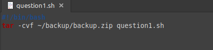
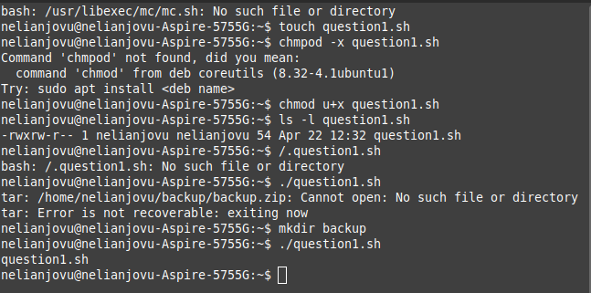
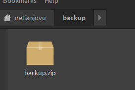
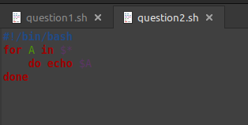
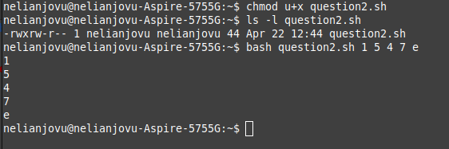
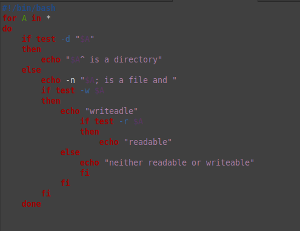
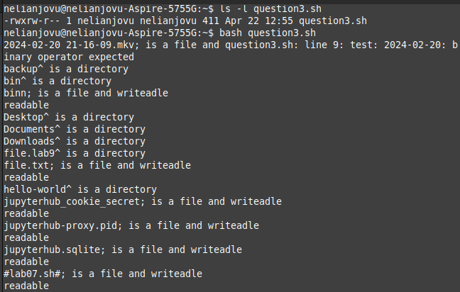
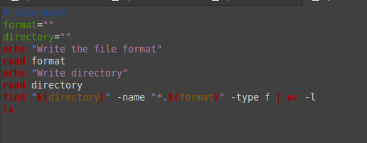
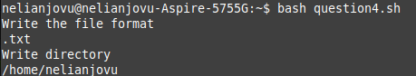

---
## Front matter
lang: ru-RU
title: Презентация по лабораторной работе No12
subtitle: Операционные системы
author:
  - Нджову Н.
institute:
  - Российский университет дружбы народов, Москва, Россия
date: 23 апреля 2024

## i18n babel
babel-lang: russian
babel-otherlangs: english

## Formatting pdf
toc: false
toc-title: Содержание
slide_level: 2
aspectratio: 169
section-titles: true
theme: metropolis
header-includes:
 - \metroset{progressbar=frametitle,sectionpage=progressbar,numbering=fraction}
 - '\makeatletter'
 - '\beamer@ignorenonframefalse'
 - '\makeatother'
---

## Цель работы

Изучить основы программирования в оболочке ОС UNIX/Linux. Научиться писать небольшие командные файлы.

## Задание

1. Написать скрипт, который при запуске будет делать резервную копию самого себя

2. Написать пример командного файла, обрабатывающего любое произвольное число аргументов командной строки, в том числе превышающее десять

3. Написать командный файл — аналог команды ls 

4. Написать командный файл, который получает в качестве аргумента командной строки формат файла (.txt, .doc, .jpg, .pdf и т.д.) и вычисляет количество таких файлов в указанной директории. 

## Выполнение лабораторной работы

Я создаю файл и пишу скрипт, который при запуске будет делать резервную копию самого себя (то есть файла, в котором содержится его исходный код) в другую директорию backup в вашем домашнем каталоге. При этом файл должен архивироваться одним из архиваторов на выбор zip, bzip2 или tar(рис.1)

{#fig:001 width=70%}

## Выполнение лабораторной работы

После этого я меняю права доступа, добавляя права выполненый и запускаю файл(рис.2 и рис.3)

{#fig:002 width=70%}

## Выполнение лабораторной работы

{#fig:003 width=70%}

## Выполнение лабораторной работы

Я создаю новый файл и пишу пример командного файла, обрабатывающего любое произвольное число аргументов командной строки, в том числе превышающее десять. Например, скрипт может последовательно распечатывать значения всех переданных аргументов(рис.4)

{#fig:004 width=70%}

## Выполнение лабораторной работы

После этого я меняю права доступа, добавляя права выполненый и запускаю файл(рис.5)

{#fig:005 width=70%}

## Выполнение лабораторной работы

Я создаю файл и пишу командный файл — аналог команды ls (без использования самой этой команды и команды dir). Требуется, чтобы он выдавал информацию о нужном каталоге и выводил информацию о возможностях доступа к файлам этого каталога(рис.6)

{#fig:006 width=70%}

## Выполнение лабораторной работы

После этого я меняю права доступа, добавляя права выполненый и запускаю файл(рис.7)

{#fig:007 width=70%}

## Выполнение лабораторной работы

Я создаю еще новый файл и пишу командный файл, который получает в качестве аргумента командной строки формат файла (.txt, .doc, .jpg, .pdf и т.д.) и вычисляет количество таких файлов в указанной директории. Путь к директории также передаётся в виде аргумента командной строки(рис.8)

{#fig:008 width=70%}

## Выполнение лабораторной работы

После этого я меняю права доступа, добавляя права выполненый и запускаю файл(рис.9)

{#fig:009 width=70%}

## Выводы

Выполняя эту лабораторную работу я изучила основы программирования в оболочке ОС UNIX/Linux и научилась писать небольшие командные файлы.
