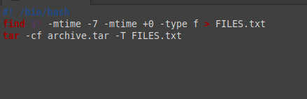

---
## Front matter
lang: ru-RU
title: Презентация по лабораторной работе 13
subtitle: Операционные системы
author:
  - Нджову Н.
institute:
  - Российский университет дружбы народов, Москва, Россия
date: 30 апреля 2024

## i18n babel
babel-lang: russian
babel-otherlangs: english

## Formatting pdf
toc: false
toc-title: Содержание
slide_level: 2
aspectratio: 169
section-titles: true
theme: metropolis
header-includes:
 - \metroset{progressbar=frametitle,sectionpage=progressbar,numbering=fraction}
 - '\makeatletter'
 - '\beamer@ignorenonframefalse'
 - '\makeatother'
---

## Цель работы

Изучить основы программирования в оболочке ОС UNIX. Научится писать более сложные командные файлы с использованием логических управляющих конструкций и циклов

## Задание

1. Используя команды getopts grep, написать командный файл, который анализирует командную строку с ключами: -iinputfile — прочитать данные из указанного файла; -ooutputfile — вывести данные в указанный файл; -pшаблон — указать шаблон для поиска; -C — различать большие и малые буквы; -n — выдавать номера строк. а затем ищет в указанном файле нужные строки, определяемые ключом -p.

2. Написать на языке Си программу, которая вводит число и определяет, является ли оно больше нуля, меньше нуля или равно нулю. Затем программа завершается с помощью функции exit(n), передавая информацию в о коде завершения в оболочку. Командный файл должен вызывать эту программу и, проанализировав с помощью команды $?, выдать сообщение о том, какое число было введено.

## Задание

3. Написать командный файл, создающий указанное число файлов, пронумерованных последовательно от 1 до n (например 1.tmp, 2.tmp, 3.tmp,4.tmp и т.д.). Число файлов, которые необходимо создать, передаётся в аргументы командной строки. Этот же командный файл должен уметь удалять все созданные им файлы (если они существуют).

4. Написать командный файл, который с помощью команды tar запаковывает в архив все файлы в указанной директории. Модифицировать его так, чтобы запаковывались только те файлы, которые были изменены менее недели тому назад (использовать команду find).

## Выполнение лабораторной работы

Я создала файл lab11-1.sh, используя команды getopts grep, я написала командный файл, который анализирует командную строку с ключами: -iinputfile — прочитать данные из указанного файла; -ooutputfile — вывести данные в указанный файл; -pшаблон — указать шаблон для поиска; -C — различать большие и малые буквы; -n — выдавать номера строк. а затем ищет в указанном файле нужные строки, определяемые ключом -p.(рис.1)

{#fig:001 width=70%}

## Выполнение лабораторной работы

После этого я поменила права доступа на файл lab11-1.sh и запустила его(рис.2) и (рис.3)

{#fig:002 width=70%}

## Выполнение лабораторной работы

{#fig:003 width=70%}

## Выполнение лабораторной работы

Я создала файл lab11-2.sh и lab11-2.cpp, написала на языке Си программу(рис.4), которая вводит число и определяет, является ли оно больше нуля, меньше нуля или равно нулю. Затем программа завершается с помощью функции exit(n), передавая информацию в о коде завершения в оболочку. Командный файл должен вызывать эту программу и, проанализировав с помощью команды $?, выдать сообщение о том, какое число было введено(рис.5)

{#fig:004 width=70%}

## Выполнение лабораторной работы

{#fig:005 width=70%}

## Выполнение лабораторной работы

После этого я поменила права доступа на файл lab11-2.sh и запустила его(рис.6)

{#fig:006 width=70%}

## Выполнение лабораторной работы

Я создала файл lab11-3.sh,написала командный файл, создающий указанное число файлов, пронумерованных последовательно от 1 до n (например 1.tmp, 2.tmp, 3.tmp,4.tmp и т.д.). Число файлов, которые необходимо создать, передаётся в аргументы командной строки. Этот же командный файл должен уметь удалять все созданные им файлы (если они существуют)(рис.7)

{#fig:007 width=70%}

## Выполнение лабораторной работы

После этого я поменила права доступа на файл lab11-3.sh и запустила его(рис.8) и (рис.9)

{#fig:008 width=70%}

## Выполнение лабораторной работы

{#fig:009 width=70%}

## Выполнение лабораторной работы

Я создала файл lab11-4.sh,написала командный файл, который с помощью команды tar запаковывает в архив все файлы в указанной директории. Модифицировать его так, чтобы запаковывались только те файлы, которые были изменены менее недели тому назад (использовать команду find)(рис.10)

{#fig:010 width=70%}

## Выполнение лабораторной работы

После этого я поменила права доступа на файл lab11-4.sh и запустила его(рис.11) и (рис.12)

{#fig:011 width=70%}

## Выполнение лабораторной работы

{#fig:012 width=70%}

## Выводы

Выпоняя эту лабораторную работу, я изучила основы программирования в оболочке ОС UNIX. Научилась писать более сложные командные файлы с использованием логических управляющих конструкций и циклов
