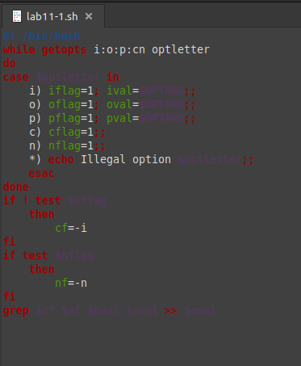
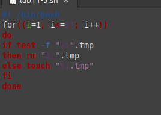

---
## Front matter
title: "Отчёт по лабораторной работе 13"
subtitle: "Операционные системы"
author: "Нелиа Нджову"

## Generic otions
lang: ru-RU
toc-title: "Содержание"

## Bibliography
bibliography: bib/cite.bib
csl: pandoc/csl/gost-r-7-0-5-2008-numeric.csl

## Pdf output format
toc: true # Table of contents
toc-depth: 2
lof: true # List of figures
lot: true # List of tables
fontsize: 12pt
linestretch: 1.5
papersize: a4
documentclass: scrreprt
## I18n polyglossia
polyglossia-lang:
  name: russian
  options:
	- spelling=modern
	- babelshorthands=true
polyglossia-otherlangs:
  name: english
## I18n babel
babel-lang: russian
babel-otherlangs: english
## Fonts
mainfont: PT Serif
romanfont: PT Serif
sansfont: PT Sans
monofont: PT Mono
mainfontoptions: Ligatures=TeX
romanfontoptions: Ligatures=TeX
sansfontoptions: Ligatures=TeX,Scale=MatchLowercase
monofontoptions: Scale=MatchLowercase,Scale=0.9
## Biblatex
biblatex: true
biblio-style: "gost-numeric"
biblatexoptions:
  - parentracker=true
  - backend=biber
  - hyperref=auto
  - language=auto
  - autolang=other*
  - citestyle=gost-numeric
## Pandoc-crossref LaTeX customization
figureTitle: "Рис."
tableTitle: "Таблица"
listingTitle: "Листинг"
lofTitle: "Список иллюстраций"
lotTitle: "Список таблиц"
lolTitle: "Листинги"
## Misc options
indent: true
header-includes:
  - \usepackage{indentfirst}
  - \usepackage{float} # keep figures where there are in the text
  - \floatplacement{figure}{H} # keep figures where there are in the text
---

# Цель работы

Изучить основы программирования в оболочке ОС UNIX. Научится писать более сложные командные файлы с использованием логических управляющих конструкций и циклов

# Задание

1. Используя команды getopts grep, написать командный файл, который анализирует командную строку с ключами: -iinputfile — прочитать данные из указанного файла; -ooutputfile — вывести данные в указанный файл; -pшаблон — указать шаблон для поиска; -C — различать большие и малые буквы; -n — выдавать номера строк. а затем ищет в указанном файле нужные строки, определяемые ключом -p.

2. Написать на языке Си программу, которая вводит число и определяет, является ли оно больше нуля, меньше нуля или равно нулю. Затем программа завершается с помощью функции exit(n), передавая информацию в о коде завершения в оболочку. Командный файл должен вызывать эту программу и, проанализировав с помощью команды $?, выдать сообщение о том, какое число было введено.

3. Написать командный файл, создающий указанное число файлов, пронумерованных последовательно от 1 до n (например 1.tmp, 2.tmp, 3.tmp,4.tmp и т.д.). Число файлов, которые необходимо создать, передаётся в аргументы командной строки. Этот же командный файл должен уметь удалять все созданные им файлы (если они существуют).

4. Написать командный файл, который с помощью команды tar запаковывает в архив все файлы в указанной директории. Модифицировать его так, чтобы запаковывались только те файлы, которые были изменены менее недели тому назад (использовать команду find).

# Выполнение лабораторной работы

Я создала файл lab11-1.sh, используя команды getopts grep, я написала командный файл, который анализирует командную строку с ключами: -iinputfile — прочитать данные из указанного файла; -ooutputfile — вывести данные в указанный файл; -pшаблон — указать шаблон для поиска; -C — различать большие и малые буквы; -n — выдавать номера строк. а затем ищет в указанном файле нужные строки, определяемые ключом -p.(рис.1)

{#fig:001 width=70%}

После этого я поменила права доступа на файл lab11-1.sh и запустила его(рис.2) и (рис.3)

{#fig:001 width=70%}

{#fig:001 width=70%}

Я создала файл lab11-2.sh и lab11-2.cpp, написала на языке Си программу(рис.4), которая вводит число и определяет, является ли оно больше нуля, меньше нуля или равно нулю. Затем программа завершается с помощью функции exit(n), передавая информацию в о коде завершения в оболочку. Командный файл должен вызывать эту программу и, проанализировав с помощью команды $?, выдать сообщение о том, какое число было введено(рис.5)

{#fig:001 width=70%}

{#fig:001 width=70%}

После этого я поменила права доступа на файл lab11-2.sh и запустила его(рис.6)

{#fig:001 width=70%}

Я создала файл lab11-3.sh,написала командный файл, создающий указанное число файлов, пронумерованных последовательно от 1 до n (например 1.tmp, 2.tmp, 3.tmp,4.tmp и т.д.). Число файлов, которые необходимо создать, передаётся в аргументы командной строки. Этот же командный файл должен уметь удалять все созданные им файлы (если они существуют)(рис.7)

{#fig:001 width=70%}

После этого я поменила права доступа на файл lab11-3.sh и запустила его(рис.8) и (рис.9)

{#fig:001 width=70%}

{#fig:001 width=70%}

Я создала файл lab11-4.sh,написала командный файл, который с помощью команды tar запаковывает в архив все файлы в указанной директории. Модифицировать его так, чтобы запаковывались только те файлы, которые были изменены менее недели тому назад (использовать команду find)(рис.10)

{#fig:001 width=70%}

После этого я поменила права доступа на файл lab11-4.sh и запустила его(рис.11) и (рис.12)

{#fig:001 width=70%}

{#fig:001 width=70%}

# Выводы

Выпоняя эту лабораторную работу, я изучила основы программирования в оболочке ОС UNIX. Научилась писать более сложные командные файлы с использованием логических управляющих конструкций и циклов

# Список литературы{.unnumbered}

лабораторная работа 12
