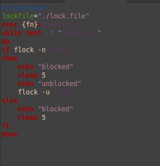
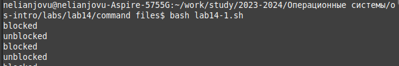
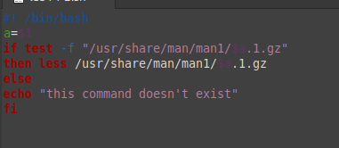
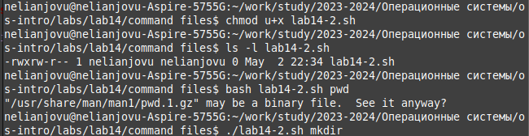
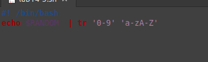
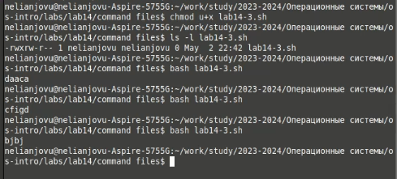

---
## Front matter
lang: ru-RU
title: Презентация по лабораторной работе 14
subtitle: Операционные системы
author:
  - Нджову Н.
institute:
  - Российский университет дружбы народов, Москва, Россия
date: 02 марта 2024

## i18n babel
babel-lang: russian
babel-otherlangs: english

## Formatting pdf
toc: false
toc-title: Содержание
slide_level: 2
aspectratio: 169
section-titles: true
theme: metropolis
header-includes:
 - \metroset{progressbar=frametitle,sectionpage=progressbar,numbering=fraction}
 - '\makeatletter'
 - '\beamer@ignorenonframefalse'
 - '\makeatother'
---

## Цель работы

Изучить основы программирования в оболочке ОС UNIX. Научиться писать более сложные командные файлы с использованием логических управляющих конструкций и циклов.

## Задание

1. Написать командный файл, реализующий упрощённый механизм семафоров. Командный файл должен в течение некоторого времени t1 дожидаться освобождения ресурса, выдавая об этом сообщение, а дождавшись его освобождения, использовать его в течение некоторого времени t2<>t1, также выдавая информацию о том, что ресурс используется соответствующим командным файлом (процессом). Запустить командный файл в одном виртуальном терминале в фоновом режиме, перенаправив его вывод в другой (> /dev/tty#, где # — номер терминала куда перенаправляется вывод), в котором также запущен этот файл, но не фоновом, а в привилегированномрежиме. Доработать программу так, чтобы имелась возможность взаимодействия трёх и более процессов.

## Задание

2. Реализовать команду man с помощью командного файла. Изучите содержимое каталога /usr/share/man/man1. В нем находятся архивы текстовых файлов, содержащих справку по большинству установленных в системе программ и команд. Каждый архив можно открыть командой less сразу же просмотрев содержимое справки. Командный файл должен получать в виде аргумента командной строки название команды и в виде результата выдавать справку об этой команде или сообщение об отсутствии справки, если соответствующего файла нет в каталоге man1.

3. Используя встроенную переменную $RANDOM, напишите командный файл, генерирующий случайную последовательность букв латинского алфавита. Учтите, что $RANDOM выдаёт псевдослучайные числа в диапазоне от 0 до 32767.

## Выполнение лабораторной работы

Я создала файл lab14-1.sh, написала командный файл, реализующий упрощённый механизм семафоров. Командный файл должен в течение некоторого времени t1 дожидаться освобождения ресурса, выдавая об этом сообщение, а дождавшись его освобождения, использовать его в течение некоторого времени t2<>t1, также выдавая информацию о том, что ресурс используется соответствующим командным файлом (процессом)(рис.1)

{#fig:001 width=50%}

## Выполнение лабораторной работы

После этого я поменила права доступа к файлу lab14-1.sh, добавляя права выполнение и запустила его(рис.2)

{#fig:002 width=70%}

## Выполнение лабораторной работы

Я создала файл lab14-2.sh, реализовала команду man с помощью командного файла.Я изучила содержимое каталога /usr/share/man/man1. В нем находятся архивы текстовых файлов, содержащих справку по большинству установленных в системе программ и команд. Каждый архив можно открыть командой less сразу же просмотрев содержимое справки. Командный файл должен получать в виде аргумента командной строки название команды и в виде результата выдавать справку об этой команде или сообщение об отсутствии справки, если соответствующего файла нет в каталоге man1(рис.3)

{#fig:003 width=60%}

## Выполнение лабораторной работы

После этого я поменила права доступа к файлу lab14-2.sh, добавляя права выполнение и запустила его(рис.4)

{#fig:004 width=70%}

## Выполнение лабораторной работы

Я создала файл lab14-3.sh, используя встроенную переменную $RANDOM,я написала командный файл, генерирующий случайную последовательность букв латинского алфавита(рис.5)

{#fig:005 width=70%}

## Выполнение лабораторной работы

После этого я поменила права доступа к файлу lab14-3.sh, добавляя права выполнение и запустила его(рис.6)

{#fig:006 width=70%}

## Выводы

Выполняя эту лабораторную работу я изучила основы программирования в оболочке ОС UNIX. Научилась писать более сложные командные файлы с использованием логических управляющих конструкций и циклов.
