---
## Front matter
lang: ru-RU
title: Индивидуальый проект этап 1, Отчет
subtitle: Операционные системы
author:
  - Нджову Н. НКАбд-04-23
institute:
  - Российский университет дружбы народов, Москва, Россия
date: 2 марта 2024

## i18n babel
babel-lang: russian
babel-otherlangs: english

## Formatting pdf
toc: false
toc-title: Содержание
slide_level: 2
aspectratio: 169
section-titles: true
theme: metropolis
header-includes:
 - \metroset{progressbar=frametitle,sectionpage=progressbar,numbering=fraction}
 - '\makeatletter'
 - '\beamer@ignorenonframefalse'
 - '\makeatother'
---

## Цель работы

Цель работы - Научиться размещать сайт на github pages.Выполнить первый этап реализации индивидуальный проект

## Задание

1. Установить необходимо ПО

2. Скачать шаблона темы сайта

3. Разместить его на хостинге git 

4. Установить параметр для URLs сайта

5. Разместить заготовку сайта на github pages

## 1.Установить необходимо ПО

Я скачиваю последнюю версию исполняемого файла hugo для своей операционной системы(рис.1)

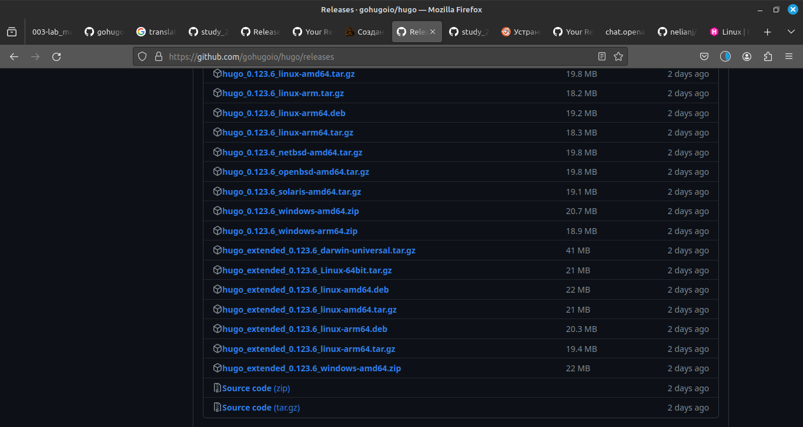{#fig:001 width=70%}

## 1.Установить необходимо ПО

Я распаковываю архив с исполняемым файлом(рис.2)

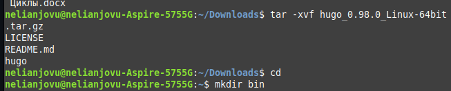{#fig:002 width=70%}

## 1.Установить необходимо ПО

Я создаю пустую папку bin в своем домашнем каталоге с помощью команду mkdir и переношу исполняемый файл hugo в эту папку(рис.3)

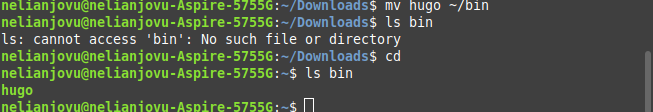{#fig:003 width=70%}

## 2. Скачать шаблона темы сайта

Я открываю репозиторий с шаблоном темы сайта (рис.4)

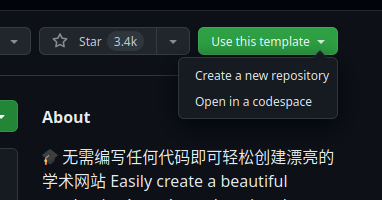{#fig:004 width=70%}

## 2. Скачать шаблона темы сайта

Я создаю репозиторий blog на основе репозиторий с шаблоном темы сайта(рис.5)

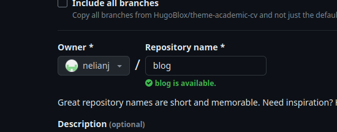{#fig:005 width=70%}

## 2. Скачать шаблона темы сайта

Я клонирую созданный репозиторий к себе в локальный репозиторий(рис.6)

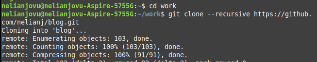{#fig:006 width=70%} 

## 3. Разместить его на хостинге git

Я запускаю исполняемый файл(рис.7)

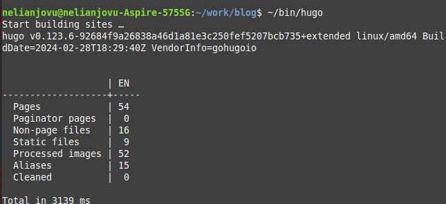{#fig:007 width=70%}

## 3. Разместить его на хостинге git

Я удаляю папку public которая сейчас нам не понадобиться, тем более мы созданим свою(рис.8)

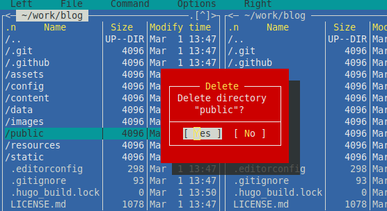{#fig:008 width=70%}

## 3. Разместить его на хостинге git

Я снова запускаю исполняемый файл с командой server(рис.9)

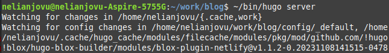{#fig:009 width=70%}

## 3. Разместить его на хостинге git

Получилась страничка сайта на локальном севере(рис.10)

{#fig:010 width=70%}

## 4. Установить параметр для URLs сайта

Теперь я создаю новый пустой репозиторий, именем которого будет адрес сайта(рис.11)

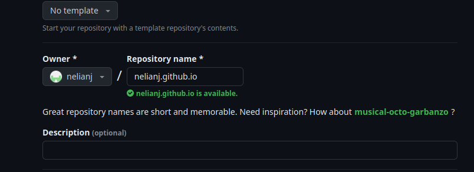{#fig:011 width=70%}

## 4. Установить параметр для URLs сайта

Я клонирую созданный репозиторий, чтобы создать локальный репозиторий у себя на компьютере(рис.12)

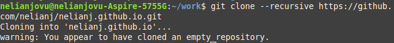{#fig:012 width=70%}

## 4. Установить параметр для URLs сайта

Я создаю главную ветку с именем main(рис.13)

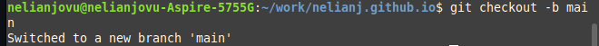{#fig:013 width=70%}

## 4. Установить параметр для URLs сайта

Я создаю пустой файл README.md и я отправляю именения в глобальный репозиторий, чтобы активировать его(рис.14)

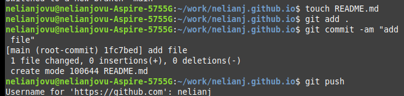{#fig:014 width=70%}

## 4. Установить параметр для URLs сайта

Перед подключением созданного пустого репозиторий к каталога public из репозитория blog, нужно отключить в файле gitignore public, чтобы каталогс таким названием не игнорировались(рис.15)

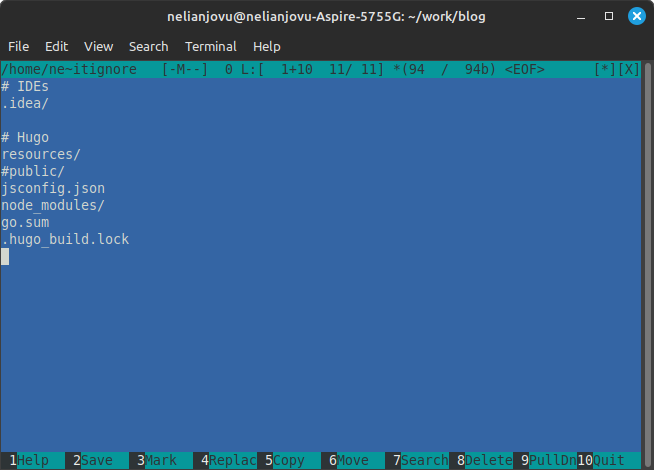{#fig:015 width=70%}

## 4. Установить параметр для URLs сайта

Я подключаю репозиторий к каталогу public(рис.16)

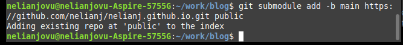{#fig:016 width=70%}

## 4. Установить параметр для URLs сайта

Я запускаю исполняемый файл, чтобы запольнить создавшийся каталог public(рис.17)

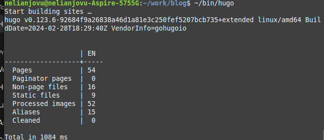{#fig:017 width=70%}

## 5. Разместить заготовку сайта на github pages

Я проверяю есть ли подключение  между public и репозиторием nelianj.github.io, после чего отправляю изменение на глобальный репозиторий(рис.18 и 19)

{#fig:018 width=70%}

## 5. Разместить заготовку сайта на github pages

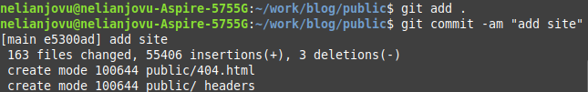{#fig:019 width=70%}

## Выводы

Выполняя первый этап индивидуального проекта, я научилась размещать сайт на github pages. 

