---
## Front matter
title: "Индивидуальый проект этап 1:Отчет"
subtitle: "Операционные системы"
author: "Нелиа Нджову"

## Generic otions
lang: ru-RU
toc-title: "Содержание"

## Bibliography
bibliography: bib/cite.bib
csl: pandoc/csl/gost-r-7-0-5-2008-numeric.csl

## Pdf output format
toc: true # Table of contents
toc-depth: 2
lof: true # List of figures
lot: true # List of tables
fontsize: 12pt
linestretch: 1.5
papersize: a4
documentclass: scrreprt
## I18n polyglossia
polyglossia-lang:
  name: russian
  options:
	- spelling=modern
	- babelshorthands=true
polyglossia-otherlangs:
  name: english
## I18n babel
babel-lang: russian
babel-otherlangs: english
## Fonts
mainfont: PT Serif
romanfont: PT Serif
sansfont: PT Sans
monofont: PT Mono
mainfontoptions: Ligatures=TeX
romanfontoptions: Ligatures=TeX
sansfontoptions: Ligatures=TeX,Scale=MatchLowercase
monofontoptions: Scale=MatchLowercase,Scale=0.9
## Biblatex
biblatex: true
biblio-style: "gost-numeric"
biblatexoptions:
  - parentracker=true
  - backend=biber
  - hyperref=auto
  - language=auto
  - autolang=other*
  - citestyle=gost-numeric
## Pandoc-crossref LaTeX customization
figureTitle: "Рис."
tableTitle: "Таблица"
listingTitle: "Листинг"
lofTitle: "Список иллюстраций"
lotTitle: "Список таблиц"
lolTitle: "Листинги"
## Misc options
indent: true
header-includes:
  - \usepackage{indentfirst}
  - \usepackage{float} # keep figures where there are in the text
  - \floatplacement{figure}{H} # keep figures where there are in the text
---

# Цель работы

Цель работы - Научиться размещать сайт на github pages.Выполнить первый этап реализации индивидуальный проект

# Задание

1. Установить необходимо ПО

2. Скачать шаблона темы сайта

3. Разместить его на хостинге git 

4. Установить параметр для URLs сайта

5. Разместить заготовку сайта на github pages

# Выполнение лабораторной работы

**1.Установить необходимо ПО**

Я скачиваю последнюю версию исполняемого файла hugo для своей операционной системы(рис.1)

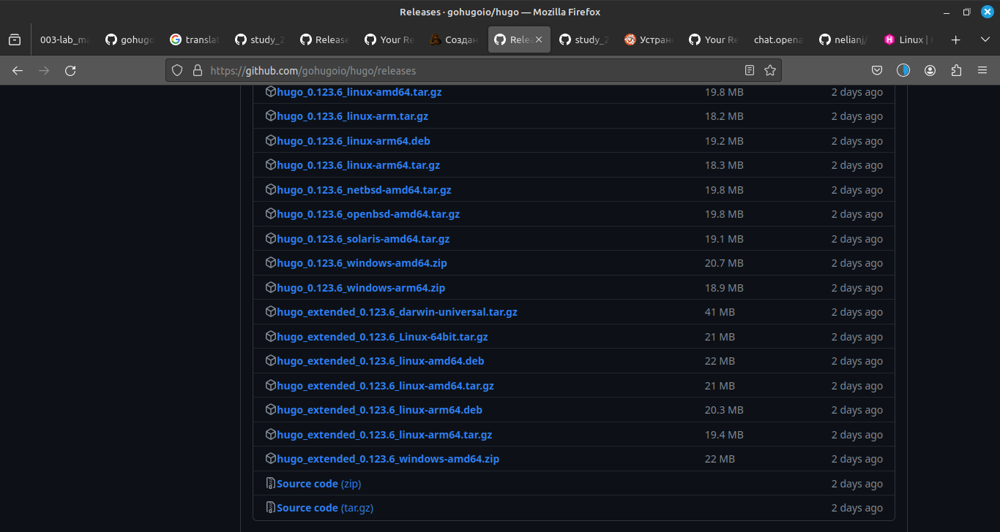{#fig:001 width=70%}

Я распаковываю архив с исполняемым файлом(рис.2)

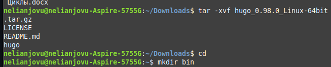{#fig:001 width=70%}

Я создаю пустую папку bin в своем домашнем каталоге с помощью команду mkdir и переношу исполняемый файл hugo в эту папку(рис.3)

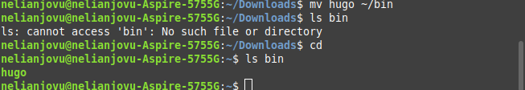{#fig:001 width=70%}

**2. Скачать шаблона темы сайта**

Я открываю репозиторий с шаблоном темы сайта (рис.4)

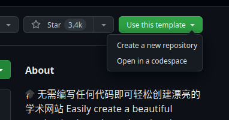{#fig:001 width=70%}

Я создаю репозиторий blog на основе репозиторий с шаблоном темы сайта(рис.5)

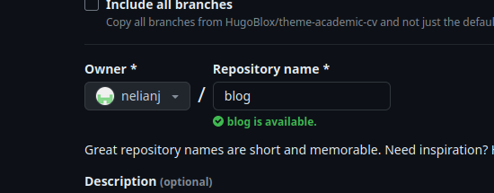{#fig:001 width=70%}

Я клонирую созданный репозиторий к себе в локальный репозиторий(рис.6)

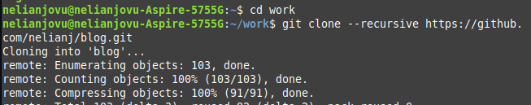{#fig:001 width=70%} 

**3. Разместить его на хостинге git**

Я запускаю исполняемый файл(рис.7)

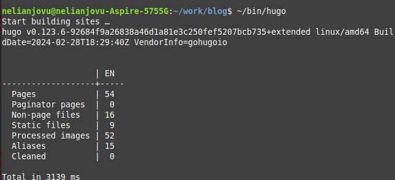{#fig:001 width=70%}

Я удаляю папку public которая сейчас нам не понадобиться, тем более мы созданим свою(рис.8)

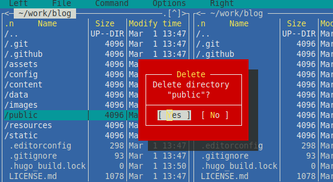{#fig:001 width=70%}

Я снова запускаю исполняемый файл с командой server(рис.9)

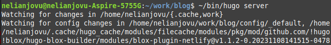{#fig:001 width=70%}

Получилась страничка сайта на локальном севере(рис.10)

{#fig:001 width=70%}

**4. Установить параметр для URLs сайта**

Теперь я создаю новый пустой репозиторий, именем которого будет адрес сайта(рис.11)

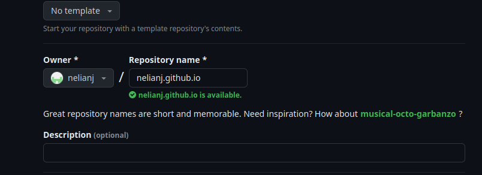{#fig:001 width=70%}

Я клонирую созданный репозиторий, чтобы создать локальный репозиторий у себя на компьютере(рис.12)

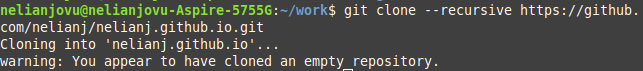{#fig:001 width=70%}

Я создаю главную ветку с именем main(рис.13)

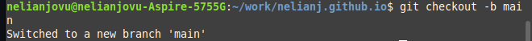{#fig:001 width=70%}

Я создаю пустой файл README.md и я отправляю именения в глобальный репозиторий, чтобы активировать его(рис.14)

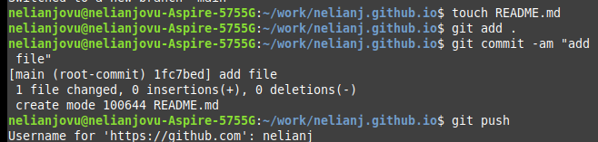{#fig:001 width=70%}

Перед подключением созданного пустого репозиторий к каталога public из репозитория blog, нужно отключить в файле gitignore public, чтобы каталогс таким названием не игнорировались(рис.15)

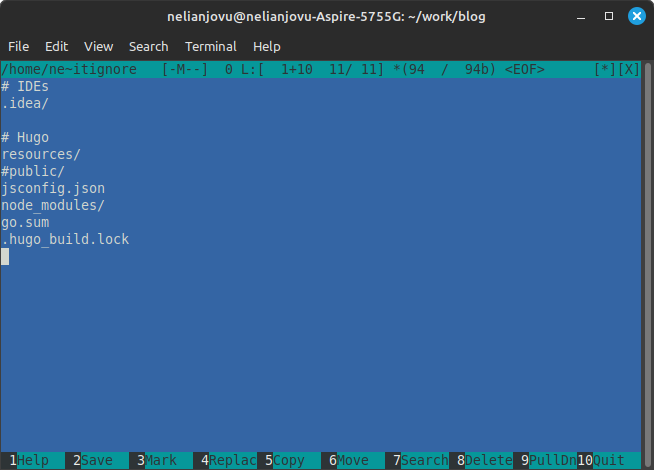{#fig:001 width=70%}

Я подключаю репозиторий к каталогу public(рис.16)

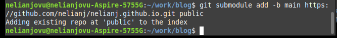{#fig:001 width=70%}

Я запускаю исполняемый файл, чтобы запольнить создавшийся каталог public(рис.17)

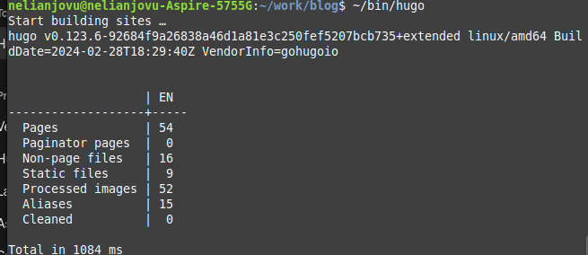{#fig:001 width=70%}

**5. Разместить заготовку сайта на github pages**

Я проверяю есть ли подключение  между public и репозиторием nelianj.github.io, после чего отправляю изменение на глобальный репозиторий(рис.18 и 19)

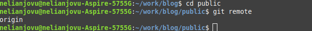{#fig:001 width=70%}

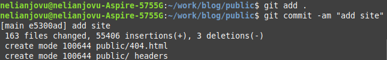{#fig:001 width=70%}

# Выводы

Выполняя первый этап индивидуального проекта, я научилась размещать сайт на github pages. 

