---
## Front matter
lang: ru-RU
title: Индивидyальный проект этап 2
subtitle: Операционный системы
author:
  - Нджову Н.
institute:
  - Российский университет дружбы народов, Москва, Россия
date: 15 марта 2024

## i18n babel
babel-lang: russian
babel-otherlangs: english

## Formatting pdf
toc: false
toc-title: Содержание
slide_level: 2
aspectratio: 169
section-titles: true
theme: metropolis
header-includes:
 - \metroset{progressbar=frametitle,sectionpage=progressbar,numbering=fraction}
 - '\makeatletter'
 - '\beamer@ignorenonframefalse'
 - '\makeatother'
---

## Цель работы

Продолжение работы с моим сайтом. Отрекдатируйте его в соответствии с требованиями. Добавлю информацию о себе.

## Задание

1. Разместить фотографию владельца сайта

2. Разместить краткое описание владельца сайта

3. Добавить информацию об интересах

4. Добавить информацию об образовании

5. Сделать пост по прошедшей неделе

6. Добавить пост на тему управление версиями. Git

## Выполнение лабораторной работы

Я заменила графическую фотографию шаблона в папке blog/content/authors/admin своей фотографией(рис.1)

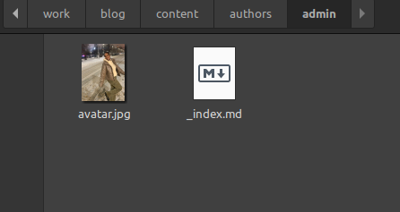{#fig:001 width=70%}

## Выполнение лабораторной работы

В той же папке я захожу в файл index.md, я меняю информацию там, начиная с библиографии(bio)(рис.2)

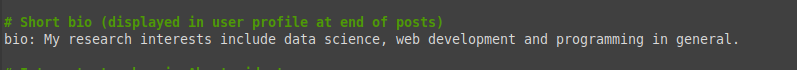{#fig:002 width=70%}

## Выполнение лабораторной работы

Я меняю интересах(interests) на свои(рис.3)

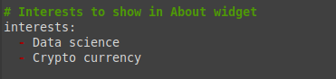{#fig:003 width=70%}

## Выполнение лабораторной работы

Я добавляю свое образование(рис.4)

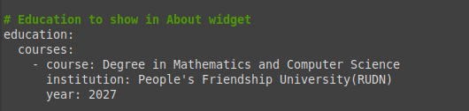{#fig:004 width=70%}

## Выполнение лабораторной работы

Я обновляю свои личные данные, чтобы они касались меня(рис.5)

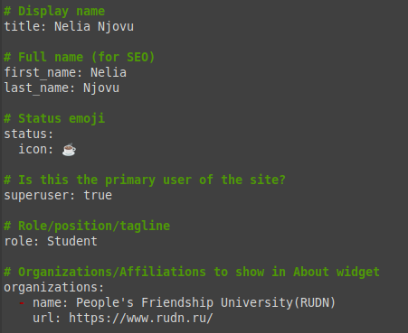{#fig:005 width=70%}

## Выполнение лабораторной работы

Я проверяю, все ли находиться на локальном сайте. Локальный сайт запускается с помощью сервера hugo(рис.6)

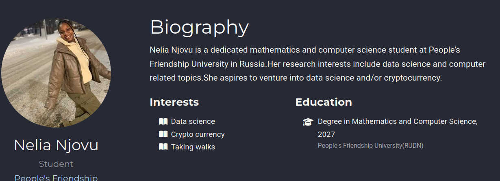{#fig:006 width=70%}

## Выполнение лабораторной работы

Я создаю папки в каталоге post, которые обозначают посты и в которых будут тексты постов, картинки и дополнительные файл(рис.7)

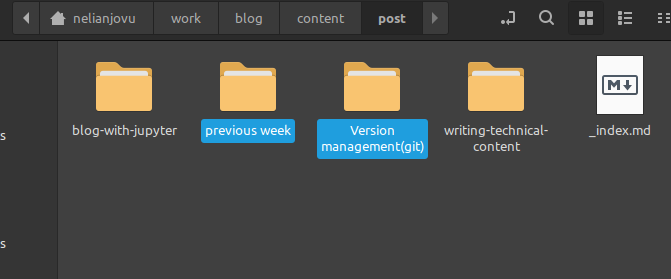{#fig:007 width=70%}

## Выполнение лабораторной работы

Я заполняю файл index.md в папке previous week, это пост о прошедшей неделе(рис.8)

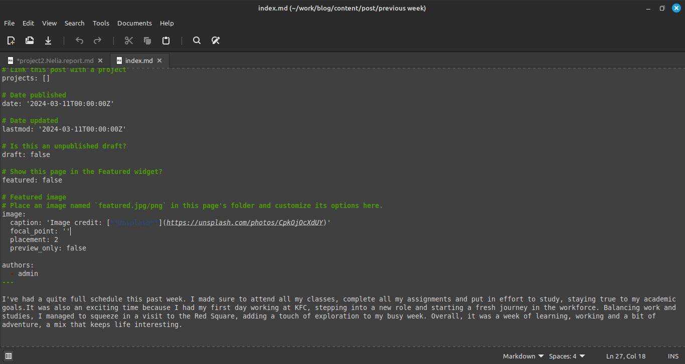{#fig:008 width=70%}

## Выполнение лабораторной работы

Я заполняю файл index.md в папке version management(git), это пост о системе управления версиями git(рис.9)

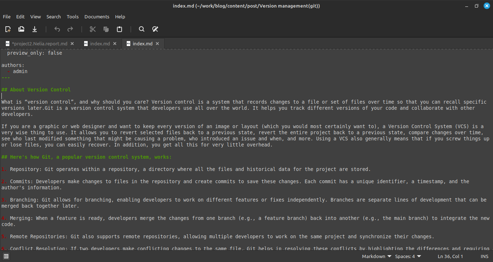{#fig:009 width=70%}

## Выполнение лабораторной работы

Я проверяю посты на локальном сервере(рис.10)

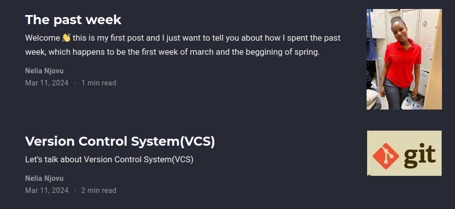{#fig:010 width=70%}

## Выполнение лабораторной работы

Я закрываю локальный сервер, я создаю веб-сайт с изменениями и сохраняю изменения в git, я также сохраняю изменения в папке, изменения в которой будут отпрвлены в репозиторий, где находиться сайт(рис.11)

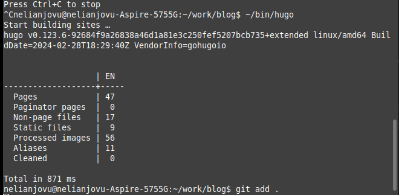{#fig:011 width=70%}

## Выполнение лабораторной работы

Я проверяю, как выглядит сайт в браузере(рис.12)

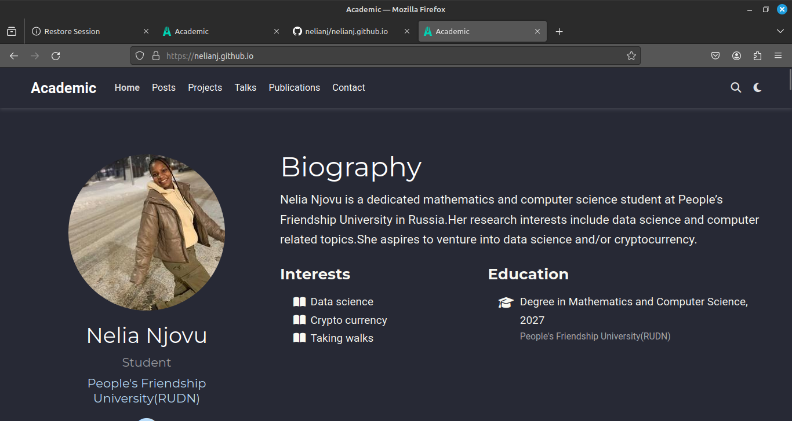{#fig:001 width=70%}

## Выводы

Выполняя второй этап индивидуального проекта, я научилась редактировать данные о себе, а также писать и добавлять их на сайт.

