---
## Front matter
title: "Индивидyальный проект этап 2"
subtitle: "Операционный системы"
author: "Нелиа Нджову"

## Generic otions
lang: ru-RU
toc-title: "Содержание"

## Bibliography
bibliography: bib/cite.bib
csl: pandoc/csl/gost-r-7-0-5-2008-numeric.csl

## Pdf output format
toc: true # Table of contents
toc-depth: 2
lof: true # List of figures
lot: true # List of tables
fontsize: 12pt
linestretch: 1.5
papersize: a4
documentclass: scrreprt
## I18n polyglossia
polyglossia-lang:
  name: russian
  options:
	- spelling=modern
	- babelshorthands=true
polyglossia-otherlangs:
  name: english
## I18n babel
babel-lang: russian
babel-otherlangs: english
## Fonts
mainfont: PT Serif
romanfont: PT Serif
sansfont: PT Sans
monofont: PT Mono
mainfontoptions: Ligatures=TeX
romanfontoptions: Ligatures=TeX
sansfontoptions: Ligatures=TeX,Scale=MatchLowercase
monofontoptions: Scale=MatchLowercase,Scale=0.9
## Biblatex
biblatex: true
biblio-style: "gost-numeric"
biblatexoptions:
  - parentracker=true
  - backend=biber
  - hyperref=auto
  - language=auto
  - autolang=other*
  - citestyle=gost-numeric
## Pandoc-crossref LaTeX customization
figureTitle: "Рис."
tableTitle: "Таблица"
listingTitle: "Листинг"
lofTitle: "Список иллюстраций"
lotTitle: "Список таблиц"
lolTitle: "Листинги"
## Misc options
indent: true
header-includes:
  - \usepackage{indentfirst}
  - \usepackage{float} # keep figures where there are in the text
  - \floatplacement{figure}{H} # keep figures where there are in the text
---

# Цель работы

Продолжение работы с моим сайтом. Отрекдатируйте его в соответствии с требованиями. Добавлю информацию о себе.

# Задание

1. Разместить фотографию владельца сайта

2. Разместить краткое описание владельца сайта

3. Добавить информацию об интересах

4. Добавить информацию об образовании

5. Сделать пост по прошедшей неделе

6. Добавить пост на тему управление версиями. Git

# Выполнение лабораторной работы

Я заменила графическую фотографию шаблона в папке blog/content/authors/admin своей фотографией(рис.1)

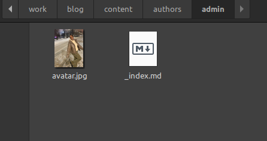{#fig:001 width=70%}

В той же папке я захожу в файл index.md, я меняю информацию там, начиная с библиографии(bio)(рис.2)

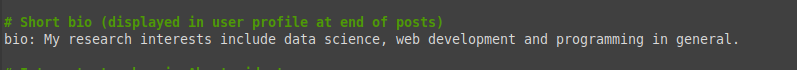{#fig:001 width=70%}

Я меняю интересах(interests) на свои(рис.3)

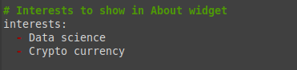{#fig:001 width=70%}

Я добавляю свое образование(рис.4)

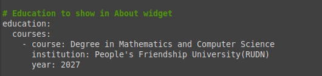{#fig:001 width=70%}

Я обновляю свои личные данные, чтобы они касались меня(рис.5)

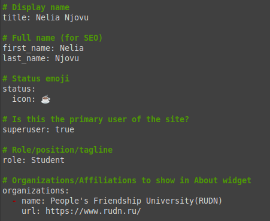{#fig:001 width=70%}

Я проверяю, все ли находиться на локальном сайте. Локальный сайт запускается с помощью сервера hugo(рис.6)

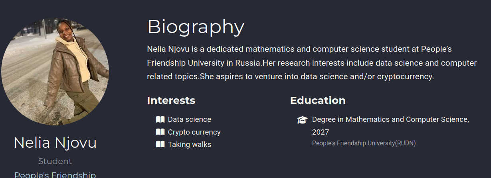{#fig:001 width=70%}

Я создаю папки в каталоге post, которые обозначают посты и в которых будут тексты постов, картинки и дополнительные файл(рис.7)

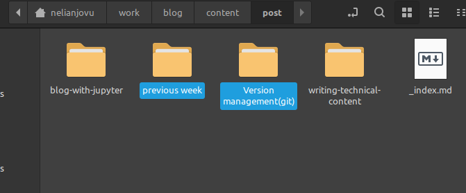{#fig:001 width=70%}

Я заполняю файл index.md в папке previous week, это пост о прошедшей неделе(рис.8)

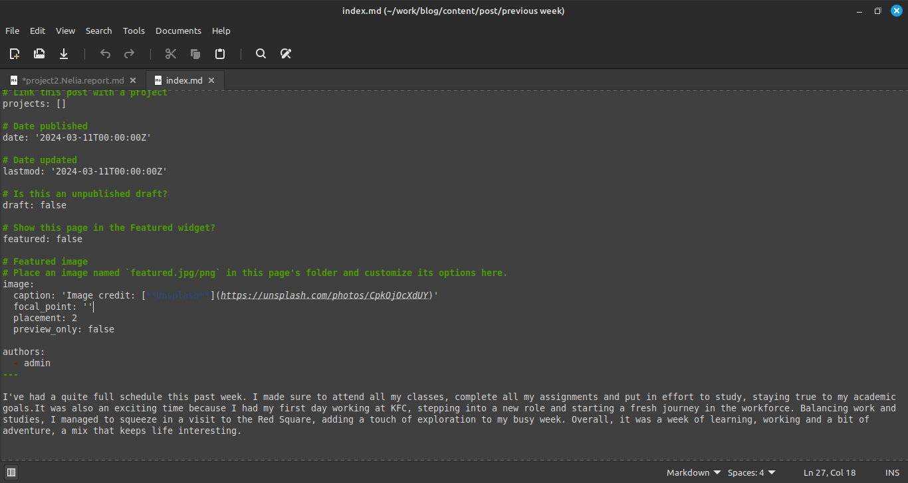{#fig:001 width=70%}

Я заполняю файл index.md в папке version management(git), это пост о системе управления версиями git(рис.9)

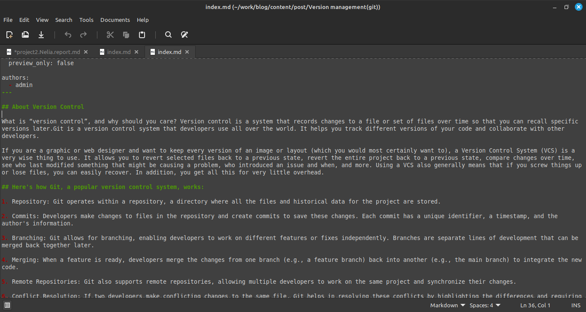{#fig:001 width=70%}

Я проверяю посты на локальном сервере(рис.10)

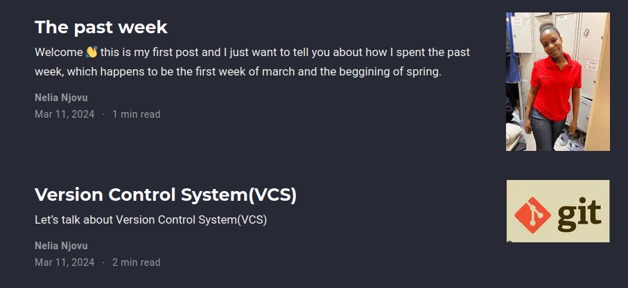{#fig:001 width=70%}

Я закрываю локальный сервер, я создаю веб-сайт с изменениями и сохраняю изменения в git, я также сохраняю изменения в папке, изменения в которой будут отпрвлены в репозиторий, где находиться сайт(рис.11)

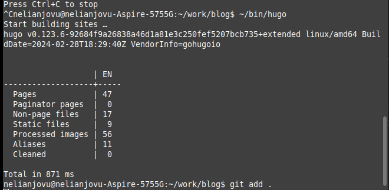{#fig:001 width=70%}

Я проверяю, как выглядит сайт в браузере(рис.12)

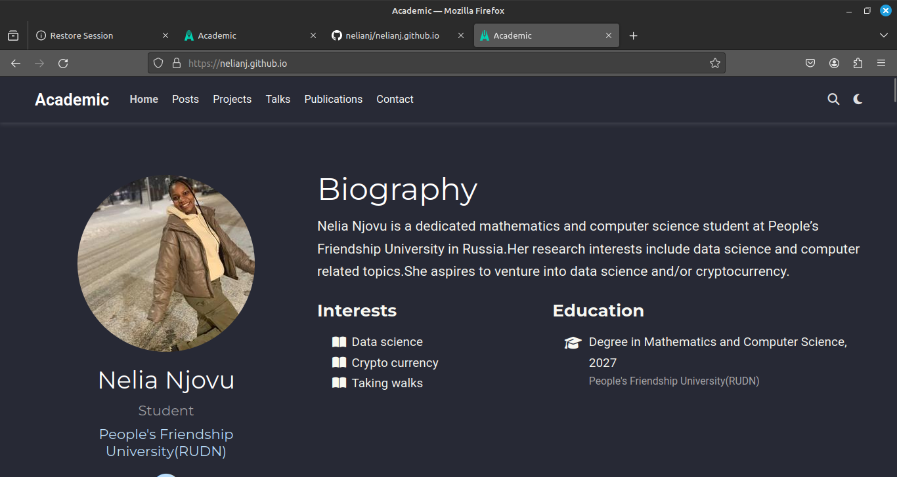{#fig:001 width=70%}

# Выводы

Выполняя второй этап индивидуального проекта, я научилась редактировать данные о себе, а также писать и добавлять их на сайт.

