---
## Front matter
lang: ru-RU
title: Презентация по проекту этап3
subtitle: Операционные системы
author:
  - Нджову Н.
institute:
  - Российский университет дружбы народов, Москва, Россия
date: 05 Апреля 2024

## i18n babel
babel-lang: russian
babel-otherlangs: english

## Formatting pdf
toc: false
toc-title: Содержание
slide_level: 2
aspectratio: 169
section-titles: true
theme: metropolis
header-includes:
 - \metroset{progressbar=frametitle,sectionpage=progressbar,numbering=fraction}
 - '\makeatletter'
 - '\beamer@ignorenonframefalse'
 - '\makeatother'
---

## Цель работы

Продолжить работы со своим сайтом. Редактировать его в соответствии с требованиями. Добавить данные о своих достижениях.

## Задание

1. Добавить информацию о навыках (Skills).

2. Добавить информацию об опыте (Experience).

3. Добавить информацию о достижениях (Accomplishments).

4. Сделать пост по прошедшей неделе.

5. Добавить пост на тему по выбору:(Язык разметки Markdown.)

## Выполнение лабораторной работы

Я захожу в терминал, перехожу в каталог ~/work/blog, я запускаю выполненый файл hugo, а потом ввожу команду ~/bin/hugo server для запуска локального сервера(рис.1)

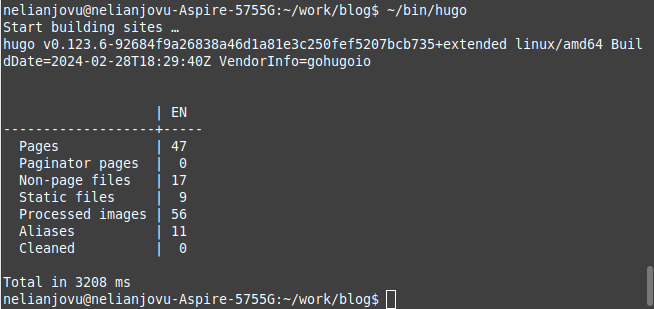{#fig:001 width=70%}

## Выполнение лабораторной работы

Я открываю нужный файл _index.md и в нем добавляю информацию о навыках(рис.2)

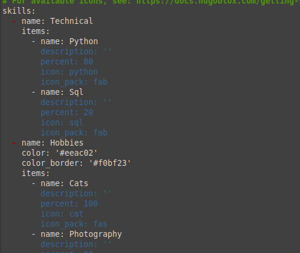{#fig:002 width=70%}

## Выполнение лабораторной работы

Потом я проверяю, отразилась ла информацию на сети(рис.3)

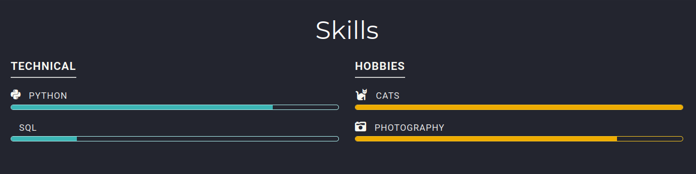{#fig:003 width=70%}

## Выполнение лабораторной работы

Далее, я добавляю свой опыт в блоке Experience(рис.4)

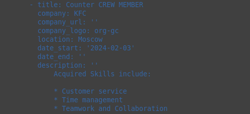{#fig:004 width=70%}

## Выполнение лабораторной работы

Я проверяю, отразилась ла информацию на сети(рис.5)

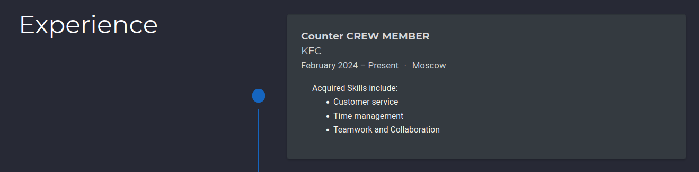{#fig:005 width=70%}

## Выполнение лабораторной работы

Далее добавляю достижения(рис.6)

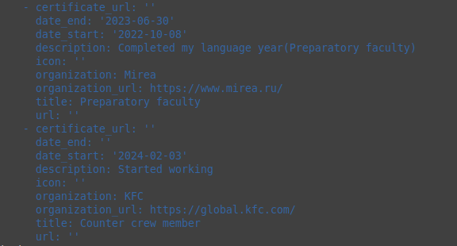{#fig:006 width=70%}

## Выполнение лабораторной работы

Я проверяю, отразилась ла информацию на сети(рис.7)

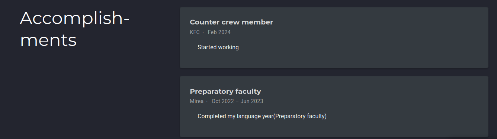{#fig:007 width=70%}

## Выполнение лабораторной работы

Я добавляю пост по прешедшей неделе в папке posts(рис.8)

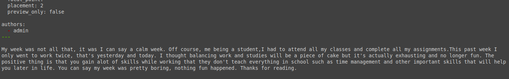{#fig:008 width=70%}

## Выполнение лабораторной работы

Я проверяю, отразилась ла информацию на сети(рис.9)

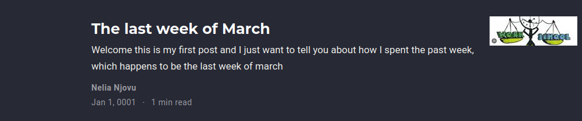{#fig:009 width=70%}

## Выполнение лабораторной работы

После этого, я добавляю пост на тему по выбору(Язык разметки Markdown)(рис.10)

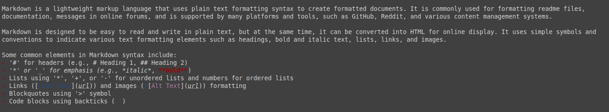{#fig:010 width=70%}

## Выполнение лабораторной работы

Я проверяю, отразилась ла информацию на сети(рис.11)

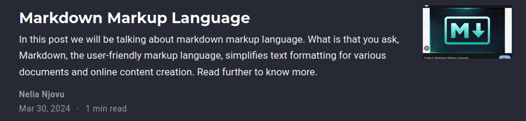{#fig:011 width=70%}

## Выполнение лабораторной работы

Я закрываю локальный сервер с помощью клавиши ctrl+c и собираю сайт с измененями, введя команду ~/bin/hugo без аргументов, потом я отпрвляю изменения на github(рис.12 и рис 13)

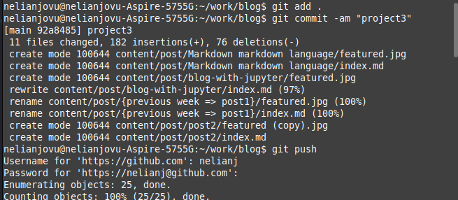{#fig:012 width=70%}

## Выполнение лабораторной работы

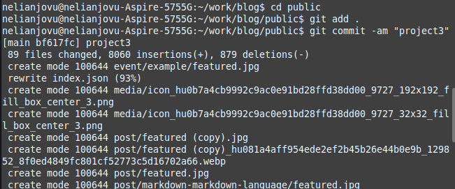{#fig:013 width=70%}

## Выполнение лабораторной работы

Проверяю, что все сделано корректно(рис.14)

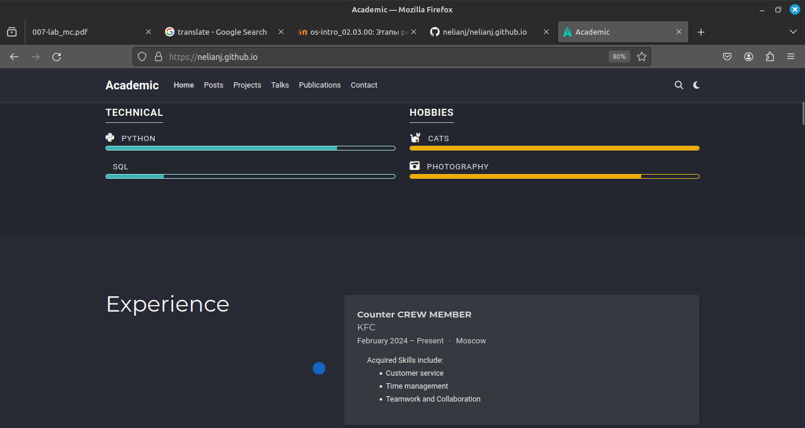{#fig:001 width=70%}

## Выводы

Выполняя третий этап проекта, я научилась редактировать данные о себе, а также писать посты и добавить их на сайт

