---
## Front matter
title: "Отчет по проекту этап3"
subtitle: "Операционные системы"
author: "Нелиа Нджову"

## Generic otions
lang: ru-RU
toc-title: "Содержание"

## Bibliography
bibliography: bib/cite.bib
csl: pandoc/csl/gost-r-7-0-5-2008-numeric.csl

## Pdf output format
toc: true # Table of contents
toc-depth: 2
lof: true # List of figures
lot: true # List of tables
fontsize: 12pt
linestretch: 1.5
papersize: a4
documentclass: scrreprt
## I18n polyglossia
polyglossia-lang:
  name: russian
  options:
	- spelling=modern
	- babelshorthands=true
polyglossia-otherlangs:
  name: english
## I18n babel
babel-lang: russian
babel-otherlangs: english
## Fonts
mainfont: PT Serif
romanfont: PT Serif
sansfont: PT Sans
monofont: PT Mono
mainfontoptions: Ligatures=TeX
romanfontoptions: Ligatures=TeX
sansfontoptions: Ligatures=TeX,Scale=MatchLowercase
monofontoptions: Scale=MatchLowercase,Scale=0.9
## Biblatex
biblatex: true
biblio-style: "gost-numeric"
biblatexoptions:
  - parentracker=true
  - backend=biber
  - hyperref=auto
  - language=auto
  - autolang=other*
  - citestyle=gost-numeric
## Pandoc-crossref LaTeX customization
figureTitle: "Рис."
tableTitle: "Таблица"
listingTitle: "Листинг"
lofTitle: "Список иллюстраций"
lotTitle: "Список таблиц"
lolTitle: "Листинги"
## Misc options
indent: true
header-includes:
  - \usepackage{indentfirst}
  - \usepackage{float} # keep figures where there are in the text
  - \floatplacement{figure}{H} # keep figures where there are in the text
---

# Цель работы

Продолжить работы со своим сайтом. Редактировать его в соответствии с требованиями. Добавить данные о своих достижениях.

# Задание

1. Добавить информацию о навыках (Skills).

2. Добавить информацию об опыте (Experience).

3. Добавить информацию о достижениях (Accomplishments).

4. Сделать пост по прошедшей неделе.

5. Добавить пост на тему по выбору:(Язык разметки Markdown.)

# Выполнение лабораторной работы

Я захожу в терминал, перехожу в каталог ~/work/blog, я запускаю выполненый файл hugo, а потом ввожу команду ~/bin/hugo server для запуска локального сервера(рис.1)

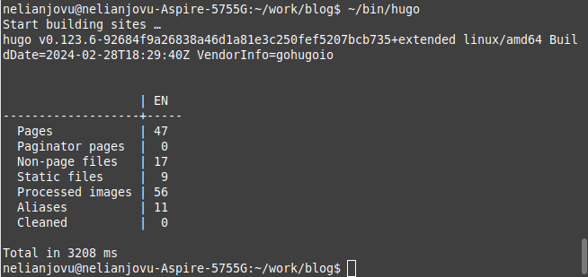{#fig:001 width=70%}

Я открываю нужный файл _index.md и в нем добавляю информацию о навыках(рис.2)

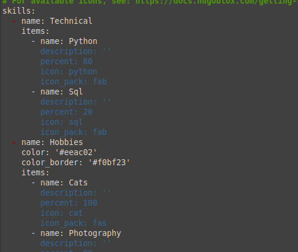{#fig:001 width=70%}

Потом я проверяю, отразилась ла информацию на сети(рис.3)

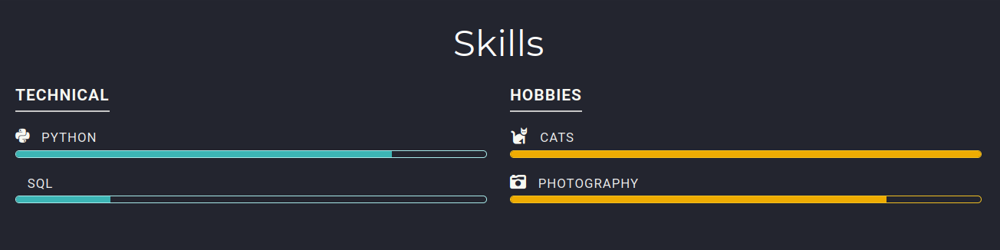{#fig:001 width=70%}

Далее, я добавляю свой опыт в блоке Experience(рис.4)

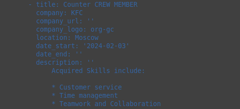{#fig:001 width=70%}

Я проверяю, отразилась ла информацию на сети(рис.5)

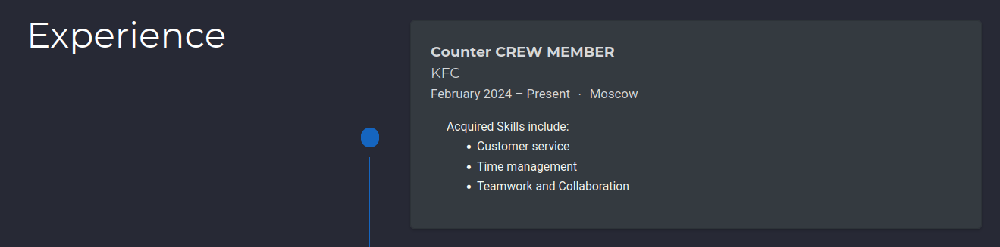{#fig:001 width=70%}

Далее добавляю достижения(рис.6)

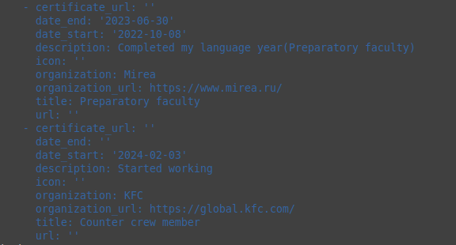{#fig:001 width=70%}

Я проверяю, отразилась ла информацию на сети(рис.7)

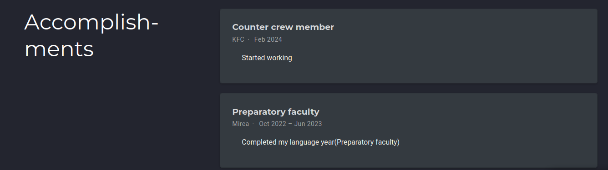{#fig:001 width=70%}

Я добавляю пост по прешедшей неделе в папке posts(рис.8)

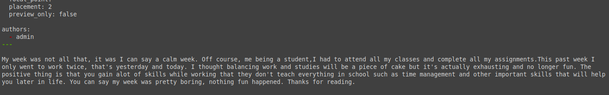{#fig:001 width=70%}

Я проверяю, отразилась ла информацию на сети(рис.9)

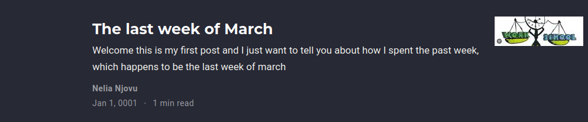{#fig:001 width=70%}

После этого, я добавляю пост на тему по выбору(Язык разметки Markdown)(рис.10)

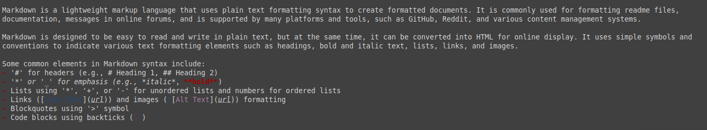{#fig:001 width=70%}

Я проверяю, отразилась ла информацию на сети(рис.11)

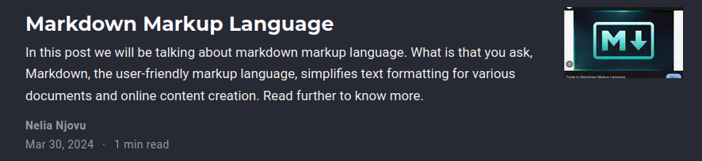{#fig:001 width=70%}

Я закрываю локальный сервер с помощью клавиши ctrl+c и собираю сайт с измененями, введя команду ~/bin/hugo без аргументов, потом я отпрвляю изменения на github(рис.12 и рис 13)

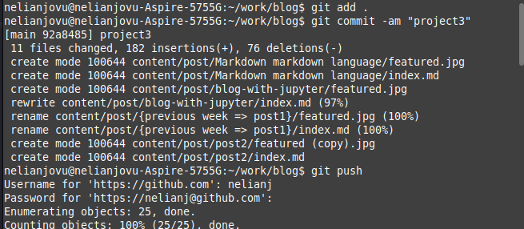{#fig:001 width=70%}

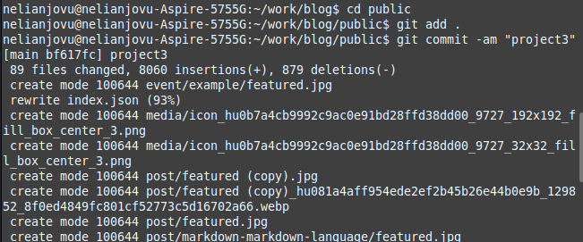{#fig:001 width=70%}

Проверяю, что все сделано корректно(рис.14)

{#fig:001 width=70%}

# Выводы

Выполняя третий этап проекта, я научилась редактировать данные о себе, а также писать посты и добавить их на сайт

