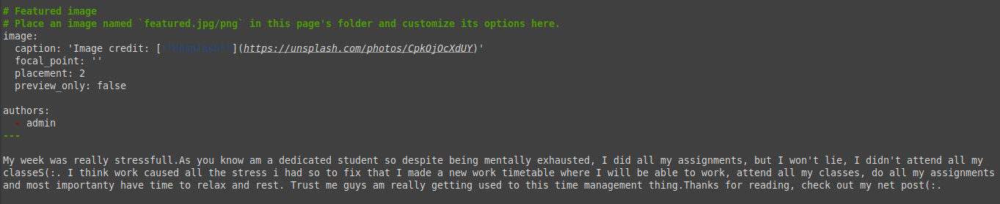

---
## Front matter
lang: ru-RU
title: Презентация по индивидуальному проекту этап4
subtitle: Операционные системы
author:
  - Нджову Н.
institute:
  - Российский университет дружбы народов, Москва, Россия
date: 21 апреля 2024

## i18n babel
babel-lang: russian
babel-otherlangs: english

## Formatting pdf
toc: false
toc-title: Содержание
slide_level: 2
aspectratio: 169
section-titles: true
theme: metropolis
header-includes:
 - \metroset{progressbar=frametitle,sectionpage=progressbar,numbering=fraction}
 - '\makeatletter'
 - '\beamer@ignorenonframefalse'
 - '\makeatother'
---

## Цель работы

Продолжить работы со своим сайтом. Редактировать его в соответствии с требованиями. Добавить ссылки.

## Задание

1. Добавить к сайту ссылки на научные и библиометрические ресурсы

2. Сделать пост по прошедшей неделе

3. Добавить пост на тему по выбору

## Выполнение лабораторной работы

Я зарегистрируюся на соответствующих ресурсах и размещаю на них ссылки на сайте(рис.1) 

{#fig:001 width=70%}

## Выполнение лабораторной работы

Я сделаю пост по прошедшей неделе(рис.2)

{#fig:002 width=70%}

## Выполнение лабораторной работы

Я добавляю пост на тему по выбору и проверяю если сделана хорошо.Я выбрала тему Оформление отчёта(рис.3)

{#fig:003 width=70%}

## Выполнение лабораторной работы

После этого я добавляю информации на github(рис.4)

{#fig:004 width=70%}

## Выводы

Выполняя эту этап я редактировала его в соответствии с требованиями и добавила ссылки.

