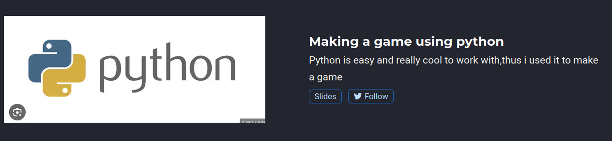
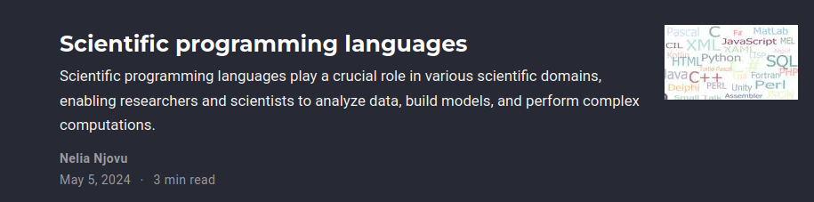
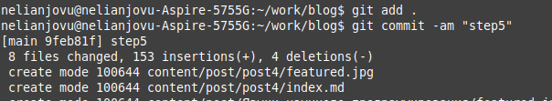

---
## Front matter
lang: ru-RU
title: Презентация по индивидуальному проекту этап5
subtitle: Операционные системы
author:
  - Нджову Н.
institute:
  - Российский университет дружбы народов, Москва, Россия
date: 05 мая 2024

## i18n babel
babel-lang: russian
babel-otherlangs: english

## Formatting pdf
toc: false
toc-title: Содержание
slide_level: 2
aspectratio: 169
section-titles: true
theme: metropolis
header-includes:
 - \metroset{progressbar=frametitle,sectionpage=progressbar,numbering=fraction}
 - '\makeatletter'
 - '\beamer@ignorenonframefalse'
 - '\makeatother'
---

## Цель работы

Продолжить работы со своим сайтом. Редактировать его в соответствии с требованиями.Сделать записи для персональных проектов.

## Задание

1. Сделать записи для персональных проектов.

2. Сделать пост по прошедшей неделе.
  
3. Добавить пост на тему по выбору.(Языки научного программирования.)

## Выполнение лабораторной работы

Сначала я сделала записи для персональных проектов и проверила если сделано в сети(рис.1)

{#fig:001 width=70%}

## Выполнение лабораторной работы

Потом я делала пост по прошедшей неделе и проверила в сети(рис.2)

{#fig:001 width=70%}

## Выполнение лабораторной работы

Наконец я делала пост на тему по выбору(Языки научного программирования)(рис.3)

{#fig:001 width=70%}

## Выполнение лабораторной работы

Я отправила все это на github(рис.4)

{#fig:001 width=70%}

## Выводы

Выполняя эту лабораторную работу я сделала записи для персональных проектов, сделала пост по прошедшей неделе и добавила пост на тему по выбору.

