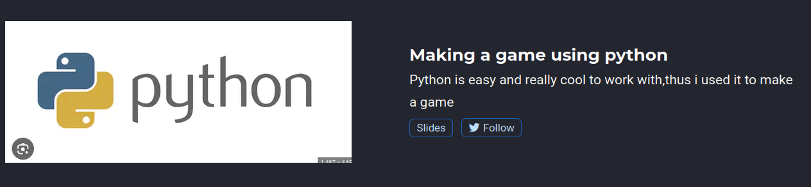
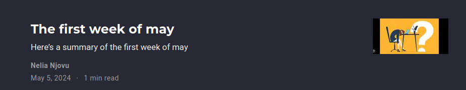
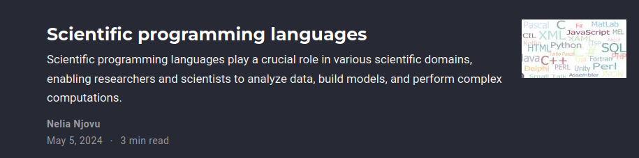
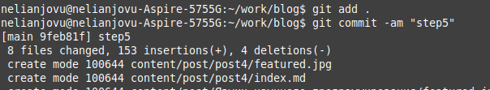

---
## Front matter
title: "Отчёт по индивидуальному проекту этап5"
subtitle: "Операционные системы"
author: "Нелиа Нджову"

## Generic otions
lang: ru-RU
toc-title: "Содержание"

## Bibliography
bibliography: bib/cite.bib
csl: pandoc/csl/gost-r-7-0-5-2008-numeric.csl

## Pdf output format
toc: true # Table of contents
toc-depth: 2
lof: true # List of figures
lot: true # List of tables
fontsize: 12pt
linestretch: 1.5
papersize: a4
documentclass: scrreprt
## I18n polyglossia
polyglossia-lang:
  name: russian
  options:
	- spelling=modern
	- babelshorthands=true
polyglossia-otherlangs:
  name: english
## I18n babel
babel-lang: russian
babel-otherlangs: english
## Fonts
mainfont: PT Serif
romanfont: PT Serif
sansfont: PT Sans
monofont: PT Mono
mainfontoptions: Ligatures=TeX
romanfontoptions: Ligatures=TeX
sansfontoptions: Ligatures=TeX,Scale=MatchLowercase
monofontoptions: Scale=MatchLowercase,Scale=0.9
## Biblatex
biblatex: true
biblio-style: "gost-numeric"
biblatexoptions:
  - parentracker=true
  - backend=biber
  - hyperref=auto
  - language=auto
  - autolang=other*
  - citestyle=gost-numeric
## Pandoc-crossref LaTeX customization
figureTitle: "Рис."
tableTitle: "Таблица"
listingTitle: "Листинг"
lofTitle: "Список иллюстраций"
lotTitle: "Список таблиц"
lolTitle: "Листинги"
## Misc options
indent: true
header-includes:
  - \usepackage{indentfirst}
  - \usepackage{float} # keep figures where there are in the text
  - \floatplacement{figure}{H} # keep figures where there are in the text
---

# Цель работы

Продолжить работы со своим сайтом. Редактировать его в соответствии с требованиями.Сделать записи для персональных проектов.

# Задание

1. Сделать записи для персональных проектов.

2. Сделать пост по прошедшей неделе.
  
3. Добавить пост на тему по выбору.(Языки научного программирования.)

# Выполнение лабораторной работы

Сначала я сделала записи для персональных проектов и проверила если сделано в сети(рис.1)

{#fig:001 width=70%}

Потом я делала пост по прошедшей неделе и проверила в сети(рис.2)

{#fig:001 width=70%}

Наконец я делала пост на тему по выбору(Языки научного программирования)(рис.3)

{#fig:001 width=70%}

Я отправила все это на github(рис.4)

{#fig:001 width=70%}

# Выводы

Выполняя эту лабораторную работу я сделала записи для персональных проектов, сделала пост по прошедшей неделе и добавила пост на тему по выбору.

